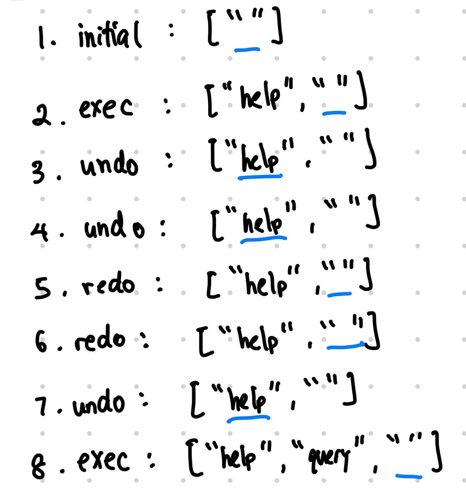

# CogniCare Developer Guide

## About CogniCare
As the job climate is worsening, more and more students become afflicted with mental health conditions due to not being able to find a job. This results in an increased workload from a larger number of patients to manage and appointments to schedule. CogniCare is a patient management system, designed to take care of SoC students who suffer from various mental health issues and concerns due to being unable to find internships or jobs.

CogniCare takes care of the load of many tedious tasks such as identifying today's appointments and measuring a patient's satisfication progress levels over a period of time, until they are finally ready for discharge.

<!-- * Table of Contents -->
<page-nav-print />

--------------------------------------------------------------------------------------------------------------------

## **Setting up, getting started**

Refer to the guide [_Setting up and getting started_](SettingUp.md).

--------------------------------------------------------------------------------------------------------------------

## **Design**

### Architecture

<puml src="diagrams/ArchitectureDiagram.puml" width="280" />

The ***Architecture Diagram*** given above explains the high-level design of the App.

Given below is a quick overview of main components and how they interact with each other.

**Main components of the architecture**

**`Main`** (consisting of classes [`Main`](https://github.com/AY2324S2-CS2103-F08-2/tp/tree/master/src/main/java/seedu/address/Main.java) and [`MainApp`](https://github.com/AY2324S2-CS2103-F08-2/tp/tree/master/src/main/java/seedu/address/MainApp.java)) is in charge of the app launch and shut down.
* At app launch, it initializes the other components in the correct sequence, and connects them up with each other.
* At shut down, it shuts down the other components and invokes cleanup methods where necessary.

The bulk of the app's work is done by the following four components:

* [**`UI`**](#ui-component): The UI of the App.
* [**`Logic`**](#logic-component): The command executor.
* [**`Model`**](#model-component): Holds the data of the App in memory.
* [**`Storage`**](#storage-component): Reads data from, and writes data to, the hard disk.

[**`Commons`**](#common-classes) represents a collection of classes used by multiple other components.

**How the architecture components interact with each other**

The *Sequence Diagram* below shows how the components interact with each other for the scenario where the user issues the command `delete 1`.

<puml src="diagrams/ArchitectureSequenceDiagram.puml" width="574" />

Each of the four main components (also shown in the diagram above),

* defines its *API* in an `interface` with the same name as the Component.
* implements its functionality using a concrete `{Component Name}Manager` class (which follows the corresponding API `interface` mentioned in the previous point.

For example, the `Logic` component defines its API in the `Logic.java` interface and implements its functionality using the `LogicManager.java` class which follows the `Logic` interface. Other components interact with a given component through its interface rather than the concrete class (reason: to prevent outside component's being coupled to the implementation of a component), as illustrated in the (partial) class diagram below.

<puml src="diagrams/ComponentManagers.puml" width="300" />

The sections below give more details of each component.

### UI component

The **API** of this component is specified in [`Ui.java`](https://github.com/AY2324S2-CS2103-F08-2/tp/tree/master/src/main/java/seedu/address/ui/Ui.java)

<puml src="diagrams/UiClassDiagram.puml" alt="Structure of the UI Component"/>

The UI consists of a `MainWindow` that is made up of parts e.g.`CommandBox`, `ResultDisplay`, `ListPanel`, `StatusBarFooter` etc. All these, including the `MainWindow`, inherit from the abstract `UiPart` class which captures the commonalities between classes that represent parts of the visible GUI.

The `UI` component uses the JavaFx UI framework. The layout of these UI parts are defined in matching `.fxml` files that are in the `src/main/resources/view` folder. For example, the layout of the [`MainWindow`](https://github.com/AY2324S2-CS2103-F08-2/tp/tree/master/src/main/java/seedu/address/ui/MainWindow.java) is specified in [`MainWindow.fxml`](https://github.com/AY2324S2-CS2103-F08-2/tp/tree/master/src/main/resources/view/MainWindow.fxml)

The `UI` component,

* executes user commands using the `Logic` component.
* listens for changes to `Model` data so that the UI can be updated with the modified data.
* keeps a reference to the `Logic` component, because the `UI` relies on the `Logic` to execute commands.
* depends on some classes in the `Model` component, as it displays `Patient` object residing in the `Model`.

### Logic component

**API** : [`Logic.java`](https://github.com/AY2324S2-CS2103-F08-2/tp/tree/master/src/main/java/seedu/address/logic/Logic.java)

Here's a (partial) class diagram of the `Logic` component:

<puml src="diagrams/LogicClassDiagram.puml" width="550"/>

The sequence diagram below illustrates the interactions within the `Logic` component, taking `execute("delete 1")` API call as an example.

<puml src="diagrams/DeleteSequenceDiagram.puml" alt="Interactions Inside the Logic Component for the `delete 1` Command" />

<box type="info" seamless>

**Note:** The lifeline for `DeleteCommandParser` should end at the destroy marker (X) but due to a limitation of PlantUML, the lifeline continues till the end of diagram.
</box>

How the `Logic` component works:

1. When `Logic` is called upon to execute a command, the command is passed to a `CommandParser` object which in turn creates a parser that matches the command (e.g., `DeleteCommandParser`) and uses it to parse the command.
1. This results in a `Command` object (more precisely, an object of one of its subclasses e.g., `DeleteCommand`) which is executed by the `LogicManager`.
2. The command can communicate with the `Model` when it is executed (e.g. to delete a patient). 
3. The result of the command execution is encapsulated as a `CommandResult` object which is returned back from `Logic`.

Here are the other classes in `Logic` (omitted from the class diagram above) that are used for parsing a user command:

<puml src="diagrams/ParserClasses.puml" width="600"/>

How the parsing works:
* When called upon to parse a user command, the `CommandParser` class creates an `XYZCommandParser` (`XYZ` is a placeholder for the specific command name e.g., `AddCommandParser`) which uses the other classes shown above to parse the user command and create a `XYZCommand` object (e.g., `AddCommand`) which the `CommandParser` returns back as a `Command` object.
* All `XYZCommandParser` classes (e.g., `AddCommandParser`, `DeleteCommandParser`, ...) inherit from the `Parser` interface so that they can be treated similarly where possible e.g, during testing.

### Model component
**API** : [`Model.java`](https://github.com/AY2324S2-CS2103-F08-2/tp/tree/master/src/main/java/seedu/address/model/Model.java)

<puml src="diagrams/ModelClassDiagram.puml" width="450" />

The `Model` component,

* stores the address book data i.e., all `Person` objects (which are contained in a `UniquePersonList` object).
* stores the currently 'selected' `Person` objects (e.g., results of a search query) as a separate _filtered_ list which is exposed to outsiders as an unmodifiable `ObservableList<Person>` that can be 'observed' e.g. the UI can be bound to this list so that the UI automatically updates when the data in the list change.
* stores a `UserPref` object that represents the user’s preferences. This is exposed to the outside as a `ReadOnlyUserPref` objects.
* does not depend on any of the other three components (as the `Model` represents data entities of the domain, they should make sense on their own without depending on other components)

### Storage component

**API** : [`Storage.java`](https://github.com/AY2324S2-CS2103-F08-2/tp/tree/master/src/main/java/seedu/address/storage/Storage.java)

<puml src="diagrams/StorageClassDiagram.puml" width="550" />

The `Storage` component,
* can save both address book data and user preference data in JSON format, and read them back into corresponding objects.
* inherits from both `AddressBookStorage` and `UserPrefStorage`, which means it can be treated as either one (if only the functionality of only one is needed).
* depends on some classes in the `Model` component (because the `Storage` component's job is to save/retrieve objects that belong to the `Model`)

### Common classes

Classes used by multiple components are in the `seedu.addressbook.commons` package.

--------------------------------------------------------------------------------------------------------------------

## **Implementation**

This section describes some noteworthy details on how certain features are implemented.

### Appointment
#### Implementation
##### Appointment Classes
Appointment is a new feature that was added to the app. It is a new entity that is related to a `Patient`. An `Appointment` object has the following attributes:
- Appointment ID
- Appointment Date Time
- Patient ID
- Attended Status
- Appointment Description

Appointment ID is a unique identifier for each appointment. It is generated by the system when a new appointment is created.

The Appointment Date Time is the date and time of the appointment.

The Patient ID is the unique identifier of the patient that the appointment is related to.

The Attended Status is a boolean value that indicates whether the patient has attended the appointment.

The Appointment Description is a String that describes the appointment.

##### Appointment Storage
Appointment are stored in the `Model` component as `AppointmentList` which contains `UniqueAppointmentList` object that is parallel similar to `PatientList` storing `UniquePatientList`. 
The `Model` component provides methods to add, delete, and retrieve appointments from `AppointmentList`

Appointment List are saved under a separate file `appointments.json` in the data folder, apart from the `patients.json` file that stores the `patientList` data.

#### Design Considerations
**Aspect: Patient ID**
- In any system that manages individual records, it is critical to ensure that we are able to distinguish between entities (which are patients) in our case.

- **Alternative 1: Using Integer ID as the primary key (Current Approach)**
  - We needed some method to ensure that the patient was unique. The primary solution implemented involves a running integer identifier - and is saved together with each patient. The identifier serves as the primary key for the patient object, similar to how a unique ID in a database ensure each record's uniqueness.
  - This was different to how the AB3 application was originally designed - where the ID followed the natural ordering of the elements in the list.
  - Pros
    - Extremely user-friendly for counsellor as ID is never changed. 
      - Potentially patient can even be issued a member card starting that patient ID.
  - Cons
    - Difficult to implement.
    - There will be "holes" in the sequential ID when records are deleted.

- **Alternative 2: Using Name as the primary key**
  - This approach was quickly deemed unsuitable due to the high probability of name duplication. While names are an important identifier, there is a great risk of collision (i.e. Jack Tan vs Jack Tan Ah Kou). While this method is sufficient for a non-mission critical address book, our CogniCare application must try to reduce the likeliness of errors occurring.
  - Pros
    - Extremely user friendly
  - Cons
    - Commands will be extremely long; and difficult to type.
    - Counsellor will need to remember exactly how the full name is spelt.
    - May select the wrong patient (i.e. Jack Tan vs Jack Tan Ah Kou).
    
- **Alternative 3: Using Natural Ordering of the names in CogniCare application (AB3 approach)**
  - As we initially strived for a design where the patientId was used like a Foreign Key in the Appointments object, the ID changing would mean that the data integrity for Appointments class would be compromised
  - Pros
    - Easy to implement
  - Cons
    - Data Integrity of Appointments will be compromised
    - Every time a patient is deleted, the subsequent IDs will be coalesced.

**Aspect: Search query with AND constraint**
### Finding Contact by different parameters.

<puml src="diagrams/FindPatientSequenceDiagram.puml" width="574" />

In enhancing the search functionality within CogniCare, the implementation of an AND constraint for search queries was paramount. This feature allows counsellors to refine search criteria, leading to more precise and relevant search results. For example, counsellors can search for a patient using a combination of (partial name AND partial phone number AND partial email address). Only parameter is required, the others are optional.

This enhancement was driven for the need of:
1. Improved Search Accuracy: By allowing multiple criteria to be specified, counsellors can narrow down search results to the most relevant patients (as the SoC cohort is quite large).
2. Efficiency: Enables quicker access to patient records by reducing the time spent sifting through irrelevant patient information.

**Single Criterion Search (AB3 Approach)**: The original AB3 approach of allowing search based on a single criterion was found to be too limiting for the different needs of patient management in CogniCare.

**Search Query with OR Constraint:** While also considered, this approach was determined to potentially yield too broad of a search result, undermining the efficiency desired in retrieving patient record.

**Aspect: Appointment ID**
- **Alternative 1 (current choice):** Generate auto-increasing fixed appointment ID when creating a new appointment. Fail commands that attempt to set the appointment ID still increase the appointment ID.
  - Pros: 
    - Easier to implement.
    - This is the implementation that take inspires from DBMS auto-increment.
    - Consistency in appointment ID.
    - Easier to store as a separate file for appointments storage.
  - Cons: Confusion for users who expect appointment ID to increase one by one.
  - Mitigation: Ensure that the appointment ID is unique.
  
- **Alternative 2 (AB3 choice):** No fixed appointment ID. AppointmentID is relative to the Appointment view.
  - Pros: More flexible for users.
  - Cons: More complex to implement. May lead to inconsistencies between appointments.

**Aspect: Where to store appointments locally**
- **Alternative 1 (current choice):** Store appointments in a separate file.
  - Pros: Easier to manage appointments separately from patients.
  - Cons: 
    - More complex to manage two separate files.
    - Time complexity to carry out command with appointments as it has to read the whole list of appointments.
  - Risks: May lead to inconsistencies between the two files in regard to ids.
  - Mitigation: Ensure that both files are updated together.
  
- **Alternative 2:** Store appointments as a field in the `Patient` class. Hence, all appointments data will be stored in the same file as the `patientList`.
  - Pros: Easier to manage a single file.
  - Cons: 
    - May lead to a more complex data structure.
    - Delete a patient will cascade delete all appointments.
  - Risks: May lead to performance issues when reading/writing data.
  - Mitigation: Optimize the data structure for reading/writing data.

**Aspect: How to store appointments**
- **Alternative 1 (current choice):** Store appointments as a `AppointmentList` in `Model`.
  - Pros: 
    - Easier to design since it is similar to `patientList` implementation.
    - If we want to add more Object for Model, this will be the default implementation
  - Cons:
    - Adding extra layer of OOP abstraction.
    - May lead to performance issues when reading/writing data (more prone to crashing issues).

- **Alternative 2:** Store appointments as a list of `Appointment` objects in `patientList`.
  - Pros: Easier to manage appointments as a list.
  - Cons: 
    - Reduce in OOP-ness of the code
    - Hard to scale up, as need to change the whole code base.
    
=======
### Command History

Command history is a feature that aims to improve the user experience for experienced users by allowing them to quickly
navigate through their history of commands to make minor changes. Many features were inspired from macOS's Bash shell

Below is a general user flow of the command history
<puml src="diagrams/CommandHistorySequenceDiagram.puml" alt="Command History sequence diagram" />

**Note** that the above diagram doesn't capture the audio playback feature because it's not a core part of the feature.

And below are the specific behaviours of the command history module

**Undo**
<puml src="diagrams/command-history/CommandHistoryUndoActivityDiagram.puml" alt="command history undo activity diagram" />

**Redo**
<puml src="diagrams/command-history/CommandHistoryRedoActivityDiagram.puml" alt="command history redo activity diagram" />

**Implementation**
An array list was used to store the history of commands and an index to indicate which command is the history currently 
at.
- The list is initialised to have an empty string as the initial element. This is so that our default behaviour of returning an empty string from pressing redo when there is no next command can be easily implemented
- The current command index defaults to 0

There are a few methods used to interact with the command history
1. **getCurrentCommand()**
   1. Gets the command at the current command index
2. **undo()**
   1. Decrements the current command index by 1
   2. If the current command index is already 0, it will play a Boop sound to indicate that there is 
are no more commands left to undo
1. **redo()**
   1. Increments the current command index by 1

Below shows expected behaviour of the command history from a series of actions. 
- blue underline - denotes where the command index
is pointing at.
- initial - the initial state of the command history
- exec - when any command is executed
- undo - decrements the index
- redo - increments the index

**Rationale for implementation**
There are a few key features that this module aims to implement
1. Improved user experience for experienced users
   1. Allow users to modify their past commands in a predictable way
   2. Allow users to easily compare past commands in case of mistakes by pressing up and down
2. Mimicking bash shell features
   1. Playing a sound to indicate that there are no more commands left to undo
   2. Empty the input box when there are no more commands left to redo
3. Default empty string in list
   1. This aims to model what the command history actually looks like. By doing this, this makes the logic much more straightforward as we don't need to constantly check to return empty string or not

**Alternatives considered**
1. 2 stacks, one undo and one redo were used at first. However, this had the drawback of not being able to remember commands after undoing and writing a new command.
2. undo() and redo() both returned the previous and next command respectively - This had a flaw in which the logic of handling the command index became unnecessarily complex as we had to worry about when we incremented/decremented an index. This also made it harder to test the functionality

=======
### Add Appointment Feature

The add appointment feature allows users to create a new appointment and insert them into the application.

**Implementation**
An observable list was used to store the list of appointments.
- The list is initialised as an empty list of type appointments in the beginning.

There are a few methods used to interact with the add appointment command.
1. AddAppointmentCommand
   1. Defines add appointment command key word and other error messages.
   2. Validates the results of the AddAppointmentCommandParser#parse()
2. AddAppointmentCommandParser#parse()
   1. Parses the add appointment commands, ensuring that all required parameters are present.
   2. Returns AddAppointmentCommand

**Rationale for implementation**
There are a few key features that this module aims to implement
1. Allow users to add new appointments to keep track of all past and upcoming appointments.

**Alternatives considered**
1. Using an array list instead of an observable list. However, the GUI was not able to accurately reflect the new appointment list when new appointments were added.

### Filter Appointment Feature

The filter appointment feature allows users to filter appointments based on the date and time of the appointment.

**Implementation**
A predicate was used to filter the list of appointments based on the date and time of the appointment.
Criteria for filtering appointments:
- `StartDateTime` the appointment is before or at (<=) the specific `startDateTime` of the predicate
- `EndDateTime` the appointment is after or at (>=) the specific `endDateTime` of the predicate
  There are a few methods used to interact with the filter appointment command.
1. `FilterAppointmentCommand`
   1. Defines filter appointment command key word and other error messages.
   2. Validates the results of the `FilterAppointmentCommandParser#parse()`
2. `FilterAppointmentCommandParser#parse()`
   1. Parses the filter appointment commands, ensuring that all required parameters are present.
   2. Check if the start date and time is before the end date and time.
   3. Returns FilterAppointmentCommand
3. `ParserUtil#parseDateTime()`
   1. Parses the date and time of the appointment, ensuring correct format
4. `ParserUtil#parseEndDateTime()` and `ParserUtil#parseStartDateTime()`
   1. Parses the start and end date and time of the appointment, ensuring correct format from calling `ParserUtil#parseDateTime()`

**Rationale for implementation**
There are a few key features that this module aims to implement
1. Allow users to filter appointments based on the date and time of the appointment.
2. Ensure that the start date and time is before the end date and time.
3. Ensure that the date and time of the appointment is in the correct format.
4. Ensure that the date and time of the appointment is correctly parsed.

**Alternatives considered**
1. Smarter filtering based on the date and time of the appointment. However, this was not implemented as it was not necessary for the current scope of the project.
### Report Patient Feedback Feature
Report patient feedback score is a feature that averages out the feedback scores of all currently filtered appointment. It allows getting the average scores of appointments within a given date range

The overall data flow of patient feedback data is detailed below by a class diagram. 
**Note**: This class diagram doesn't represent the command, but rather, how data is stored
<puml src="diagrams/PatientFeedbackReportClassDiagram.puml" alt="Report Feedback Class Diagram" />

Below is a sequence diagram of the user flow of the report command
<puml src="diagrams/ReportFeedbackSequenceDiagram.puml" alt="Report Feedback Sequence Diagram" />

**Implementation**
1. `PatientFeedbackReport` - A model that contains information from both Patient and Appointments. It uses both data to determine which appointments to calculate the average from
2. `PatientFeedbackReportList` - Contains a list of patinet feedback reports
3. `ReportFeedbackCommand` - Reports the average feedback score for a given date range
4. `ReportFeedbackCommandParser`- Parses ReportFeedbackCommand accordingly
5. `FeedbackScore` - Contains a nullable Integer field. If it is null, then there is no rating for the appointment yet

**Rationale for Implementation**
1. High-level structure for `ReportFeedbackCommand`, `ReportFeedbackCommandParser` and `PatientFEedbackReportList` was inspired from previous implementations of similar models
2. Integer was used for `FeedbackScore` because:
   1. We did not want to make FeedbackScore compulsory to add when creating an appointment
   2. The primitive type `int` is not nullable, so we used a wrapper class instead
3. `PatientFeedbackReport` is different from Appointment and Patient because it holds transient data and is dependent on data from the Patient and Appointment models.
   1. Therefore, it was decided that the entire list of appointments and a specified patient data should be passed into this object in order to calculate the average feedback score
4. `PatientFeedbackReportList` does not have any direct list modification methods of its own. It only has a generateReportList function which is called every time there is an update to the list of patients or appointments, e.g. filter, add, edit or delete
   1. To achieve such reactivity, `generateReportList()` was called at the end of each such function inside `ModelManager`

**Alternatives considered**
1. `PatientFeedbackReport` - We considered just passing the required fields, however there were a few limitations
   1. Passing only the Patient name and ID
      1. We need the name for sorting and UI purposes and we need the patient ID to determine which appointments to select. This resulted in 2 fields from the same object, which could be simplified if we just pass in a single Patient object
    2. Passing only the patient's list of appointments instead of all appointments
       1. This quickly proved to be very complex because we would need to filter appointments every time a patient or appointment was updated in the list
2. `FeedbackScore` data representation
   1. A string data type was considered to represent the Feedback Score, however, it simply did not make sense logically-speaking, and thus, we used an Integer instead.
   2. A 0 was considered to represent the null value of a feedback score. This was because we did not have any actually null fields in the previous code base, with FeedbackScore being the only nullable field. However, having 0 represent the null value is confusing and also prone to error, in case someone decided to edit the feedbaCkScore to any other value, e.g. -1
3. An observer pattern was considered when implementing the `generateReportList()` fucntionality, however, it was scrapped because it was already implemented via the `ObservableList` fields and implementing the pattern fully would not be worth the refactor 

### \[Proposed\] Undo/redo feature

#### Proposed Implementation

The proposed undo/redo mechanism is facilitated by `VersionedAddressBook`. It extends `AddressBook` with an undo/redo history, stored internally as an `addressBookStateList` and `currentStatePointer`. Additionally, it implements the following operations:

* `VersionedAddressBook#commit()` — Saves the current address book state in its history.
* `VersionedAddressBook#undo()` — Restores the previous address book state from its history.
* `VersionedAddressBook#redo()` — Restores a previously undone address book state from its history.

These operations are exposed in the `Model` interface as `Model#commitAddressBook()`, `Model#undoAddressBook()` and `Model#redoAddressBook()` respectively.

Given below is an example usage scenario and how the undo/redo mechanism behaves at each step.

Step 1. The user launches the application for the first time. The `VersionedAddressBook` will be initialized with the initial address book state, and the `currentStatePointer` pointing to that single address book state.

<puml src="diagrams/UndoRedoState0.puml" alt="UndoRedoState0" />

Step 2. The user executes `delete 5` command to delete the 5th patient in the address book. The `delete` command calls `Model#commitAddressBook()`, causing the modified state of the address book after the `delete 5` command executes to be saved in the `addressBookStateList`, and the `currentStatePointer` is shifted to the newly inserted address book state.

<puml src="diagrams/UndoRedoState1.puml" alt="UndoRedoState1" />

Step 3. The user executes `add n/David …​` to add a new patient. The `add` command also calls `Model#commitAddressBook()`, causing another modified address book state to be saved into the `addressBookStateList`.

<puml src="diagrams/UndoRedoState2.puml" alt="UndoRedoState2" />

<box type="info" seamless>

**Note:** If a command fails its execution, it will not call `Model#commitAddressBook()`, so the address book state will not be saved into the `addressBookStateList`.

</box>

Step 4. The user now decides that adding the patient was a mistake, and decides to undo that action by executing the `undo` command. The `undo` command will call `Model#undoAddressBook()`, which will shift the `currentStatePointer` once to the left, pointing it to the previous address book state, and restores the address book to that state.

<puml src="diagrams/UndoRedoState3.puml" alt="UndoRedoState3" />
a

<box type="info" seamless>

**Note:** If the `currentStatePointer` is at index 0, pointing to the initial AddressBook state, then there are no previous AddressBook states to restore. The `undo` command uses `Model#canUndoAddressBook()` to check if this is the case. If so, it will return an error to the user rather
than attempting to perform the undo.

</box>

The following sequence diagram shows how an undo operation goes through the `Logic` component:

<puml src="diagrams/UndoSequenceDiagram-Logic.puml" alt="UndoSequenceDiagram-Logic" />

<box type="info" seamless>

**Note:** The lifeline for `UndoCommand` should end at the destroy marker (X) but due to a limitation of PlantUML, the lifeline reaches the end of diagram.

</box>

Similarly, how an undo operation goes through the `Model` component is shown below:

<puml src="diagrams/UndoSequenceDiagram-Model.puml" alt="UndoSequenceDiagram-Model" />

The `redo` command does the opposite — it calls `Model#redoAddressBook()`, which shifts the `currentStatePointer` once to the right, pointing to the previously undone state, and restores the address book to that state.

<box type="info" seamless>

**Note:** If the `currentStatePointer` is at index `addressBookStateList.size() - 1`, pointing to the latest address book state, then there are no undone AddressBook states to restore. The `redo` command uses `Model#canRedoAddressBook()` to check if this is the case. If so, it will return an error to the user rather than attempting to perform the redo.

</box>

Step 5. The user then decides to execute the command `list`. Commands that do not modify the address book, such as `list`, will usually not call `Model#commitAddressBook()`, `Model#undoAddressBook()` or `Model#redoAddressBook()`. Thus, the `addressBookStateList` remains unchanged.

<puml src="diagrams/UndoRedoState4.puml" alt="UndoRedoState4" />

Step 6. The user executes `clear`, which calls `Model#commitAddressBook()`. Since the `currentStatePointer` is not pointing at the end of the `addressBookStateList`, all address book states after the `currentStatePointer` will be purged. Reason: It no longer makes sense to redo the `add n/David …​` command. This is the behavior that most modern desktop applications follow.

<puml src="diagrams/UndoRedoState5.puml" alt="UndoRedoState5" />

The following activity diagram summarizes what happens when a user executes a new command:

<puml src="diagrams/CommitActivityDiagram.puml" width="250" />

#### Design considerations:

**Aspect: How undo & redo executes:**

* **Alternative 1 (current choice):** Saves the entire address book.
  * Pros: Easy to implement.
  * Cons: May have performance issues in terms of memory usage.

* **Alternative 2:** Individual command knows how to undo/redo by
  itself.
  * Pros: Will use less memory (e.g. for `delete`, just save the patient being deleted).
  * Cons: We must ensure that the implementation of each individual command are correct.

_{more aspects and alternatives to be added}_

### \[Proposed\] Data archiving

_{Explain here how the data archiving feature will be implemented}_

## Create a new Patient

`AddPatientCommandParser` obtains the values that correspond to the prefixes such as `/p`, `/n`, `/e`, and `/a` which represent phone, name, email address, and alias accordingly.

This class ensures that
* The data stored must contain the name, phone, and email address corresponding to their respective format.
* Values that are corresponding to each tag are valid.
* There can be multiple aliases (`a/`), but `p/`, `n/`, `e/` may only appear once.
* A unique Id is created for each patient. This ID is strictly increasing and remains tagged to the patient (and does not change its order even if other records prior get deleted).
* Names are also used as a primary key (meaning no 2 users of the same name may be added to the CogniCare application) regardless of case sensitivity and whitespace, i.e. "JEROME CHUA" and "jErOmE    CHuA" are treated the same.

If the constraints are violated, `AddPatientCommandParser` will throw a `ParseException` and log the invalid parameter passed into the function.

Otherwise, if the process is successful, a new `Patient` object will be created to add the patient to the CongiCare application.

We have considered these alternatives:
* Using the natural order of the list as the index of the Person. This is sub-optimal as holes in the records may lead to unexpected behaviour when handling the appointments. For example, consider a list with 3 patients. If the second patient is deleted, then the 3rd patient becomes the 2nd patient. This will be confusing for the user. Therefore, we sought to seek a solution to ensure that the studentId always remains unique.
* Completely re-writing AB3's addressbook. This is not practical as our functionalities and use-case is similar to the use case of the AB3 application.

## Editing a current Patient
`EditPatientCommandParser` obtains the patient index and the values that correspond to the prefixes such as `/p`, `/n`, `/e`, and `/a` which represent phone, name, email address, and alias accordingly.

* There can be multiple aliases (`\a`), but `/p`, `/n`, `/e` may only appear once.
* The patient index is based on the unique ID that is tagged to each patient, and is not the natural ordering of the list.
* The edited fields are required to have the same validation as creating a new patient.

If the constraints are violated, `EditPatientCommandParser` will throw a `ParseException` due to invalid patient ID or invalid parameter being parsed.

Otherwise, if the process is successful, the current `Patient` object corresponding to the respective ID will be updated with the editedInformation.

We have considered these alternatives:
* Using the name as the primary key instead of the patient ID - may lead to unexpected deletes as there could be a case where the counselor has two patients of the similar name "Tan Ah Kow" and "Tan Ah". Suppose the counselor wants to delete "Tan Ah", and not "Tan Ah Kou" - in this case, the wrong record will be deleted by accident. Using an integer value as the identifier would eliminate this problem and will also makes it much easier for the user to input the commands.
  * Therefore the workflow would be to search for the respective patient for the respective index via the `queryp` command before editing it.

## Deleting an existing patient
`DeletePatientCommandParser` obtains the patient index that is to be deleted.

* The patient index is based on the unique ID that is tagged to each individual patient and is not the natural ordering of the list.

If the constraints are violated, `DeletePatientCommandParser` will throw a `ParseException` due to an invalid patient ID passed.

Otherwise, if the process is successful, the current `Patient` object corresponding to the respective ID will be updated with the deleted patient information containing the phone, email, and respective alias information.

We have considered these alternatives:
* A confirmation dialog when deleting the patients. We decided to not go with this approach as this drastically reduces the speed which the user makes use of the application.
* Deleting the student using the natural order of the list may also result in unintended deletions.

## Querying for Patients
`ListPatientCommandParser` obtains the values that correspond to the criteria such as `/p`, `/n`, `/e` and `/a` which represent phone, name, email address, and alias(es) accordingly, and combined with an AND logic.

The command for this operation is `queryp` with at least one or zero parameters. If no parameters (or at least one invalid parameter is passed into the command), the `queryp` command returns all the information of the patients (that is applied without any filters/predicates).

The `ListPatientCommandParser` first checks for the presence of empty arguments / no prefix being specified. If this criterion is true, then all the patient is returned as normal. As such this class does not throw any exceptions, but just returns all the data in the CogniCare application.

Otherwise, each of the search terms will be applied to each of the respective fields of the CogniCare application in a case-insensitive format.

We have considered these alternatives:
- User-Forgiveness _versus_ Strict Error Handling: Returning an error message where the command is correct, but illegal parameters are being supplied, then an error message is displayed. We decided against this approach because this will reduce the "user friendliness" of the application as the user would then have the consult the manual / read the error message to resolve the error.
- Creating a "do-it-all" predicate for the `Patient` class will be less repetitive code as compared to the current approach (`EmailContainsKeywordPredicate.java`, `NameContainsKeywordPredicate.java`, `PhoneContainsKeywordPredicate.java`, `TagContainsKeywordPredicate.java`) which requires more (repetitive code) as compared to making a class such as `StudentContainsKeywordPredicate.java` which would be easier to code - but harder to test and extend in future. Not to mention, this will also increase the difficulty in writing unit tests.
- Using `AND` logic for combining predicates, instead of `OR` predicate - the reason was that since the values already supported partial word matching (i.e. Searching for `coco` in the String `Coconut` will result in the row being returned). As such, using the `OR` logic will lead to too many rows being returned and therefore confusing to the user.
- Using case-insensitive search: the use of case-insensitive search terms for parameters matching provides a more seamless and more user-friendly experience.
--------------------------------------------------------------------------------------------------------------------

## **Documentation, logging, testing, configuration, dev-ops**

* [Documentation guide](Documentation.md)
* [Testing guide](Testing.md)
* [Logging guide](Logging.md)
* [Configuration guide](Configuration.md)
* [DevOps guide](DevOps.md)

--------------------------------------------------------------------------------------------------------------------

## **Appendix: Requirements**

### Product scope

**Target user profile**:

This product is for staff at SoC Center for Future Graduates (CFG), and is specifically targeted towards Buck Seng, our target audience. This product aims to help make managing his patients easier

The following further describes our user

* has a need to manage a significant number of contacts due to the large number of students requiring counselling services
* prefer desktop apps over other types
* can type fast
* prefers typing to mouse interactions
* is technically competent
* is reasonably comfortable using CLI apps
* only a single user

**Value proposition**: 

CogniCare provides a comprehensive set of features that help streamline especially tedious tasks such as:
1. Looking up what appointments are there in a given time period to clear up the schedule
2. Report patient satisfaction levels over a given time period
3. Updating a patient's data across all their appointments. E.g. Updating a person's phone number or removing the patient and their associated appointments from UI

Furthermore, CogniCare's operations are specialised for technically competent users who type fast, which matches Buck Seng's description.

### User stories

Priorities: High (must have) - `* * * *`, Medium (nice to have) - `* * *`, Low (unlikely to have) - `* *`, Not essential (implement only if got time) - ` * `

| Priority  | As a …​          | I want to …​                                              | So that I can…​                                                                                            |
|-----------|------------------|-----------------------------------------------------------|------------------------------------------------------------------------------------------------------------|
| `* * * *` | Counsellor       | create new patients                                       | store their data for future sessions.                                                                      |
| `* * * *` | Counsellor       | view patient data                                         | view their contact information and contact them.                                                           |
| `* * * *` | Counsellor       | delete patient data at a given index                      | discharge the patient.                                                                                     |
| `* * * *` | Counsellor       | search for a patient                                      | quickly access and review patient status.                                                                  |
| `* * * *` | Counsellor       | list patient at the given index                           | quickly access patients that come regularly.                                                               |
| `* * * *` | Counsellor       | schedule appointments                                     | avoid scheduling overlapping appointments with other patients.                                             |
| `* * * *` | Counsellor       | delete an appointment for a specific patient              | appointments can be changed in cases of cancellation.                                                      |
| `* * * *` | Counsellor       | view one appointment for a specified patient              | quickly find and review the appointment notes.                                                             |
| `* * * *` | Counsellor       | view all appointments for a specified patient             | quickly view all appointments related to a student without having to remember the appointment ID or dates. |
| `* * * *` | Counsellor       | view patient case logs                                    | understand where I left off with the patient last time.                                                    |
| `* * * *` | Counsellor       | create patient logs                                       | note down what I went through with the patient during the session.                                         |
| `* * * *` | Counsellor       | update counselling sessions                               | fix mistakes for a prior counselling session.                                                              |
| `* * *`   | Counsellor       | to categorise / tag my patients                           | patients with more serious issues can be attended to first.                                                |
| `* * * `  | Counsellor       | know how many patients I am seeing in a week              | better manage my own time and emotions.                                                                    |
| `* * *`   | Counsellor       | know what mistakes I make when creating patients          | easily understand how to rectify my mistakes                                                               |
| `* * *`   | Counsellor       | know know what mistakes I make when creating appointments | easily understand how to rectify my mistakes                                                               |
| `* * *`   | Counsellor       | be able to mark whether a patient attended a session      | properly document patients’ attendance                                                                     |
| `* * *`   | New User         | have a help function                                      | so that I know how to use the application.                                                                 |
| `* *`     | Counsellor       | sort patients based on their priority tag                 | more serious patients can be attended first.                                                               |
| `* *`     | Experienced User | navigate through my history of written commands           | avoid retyping a command just to make minor modifications to a previous command.                           |
| `*`       | Experienced User | mass delete patient data                                  | patient data is not compromised.                                                                           |

### Use cases

(For all use cases below, the **System** is the `CogniCare` application and the **Actor** is the `user`, unless specified otherwise)

**Use case: Add a Patient**
1. User enters command to add a patient with all mandatory information (Name, Email, Phone Number). Associated with is optional.
2. CogniCare validates the information are valid.
3. CogniCare saves the new patient information.
4. CogniCare displays a success message confirming that the new patient has been added.

**Extensions**

* 1a. Required fields are left blank, or fields do not meet the specified format.
  * 1ai. CogniCare displays error message associated with the relevant missing field (i.e. Phone number error message for missing phone number field)
    Use case ends

* 2a. Required fields are invalid (i.e. Phone Number does not meet SG format)
  * 2ai. CogniCare displays error message associated with the relevant erroneous field (i.e. Phone number error message for invalid phone number field)
    Use case ends
  
* 2b. Patient with the same name (regardless of case sensitivity and whitespace) already exists.
  * 2bi. CogniCare alerts the user about the duplicate name and prevents the addition.
  Use case ends.

**Use Case: Edit a Patient**
<puml src="diagrams/EditPatientSequenceDiagram.puml" width="280" />

1. User enters command to add a patient with required index and data field to be edited.
2. CogniCare displays a success message confirming the patient's details have been updated.
Use case ends.

**Extensions**
* 1a. The patient identifier does not match any patient in the system.
  * 1a1. CogniCare displays an error message that the patient was not found.
  Use case ends.

* 2a. Required data fields are left blank or data is in the incorrect format.
  * 2a1. CogniCare displays an error message indicating what needs to be corrected or filled in, including the specific requirements for the phone number and email format.
  Use case ends.

* **Use case: List all / Search for patients meeting selected criteria / criterion**

**MSS**

1.  User requests to list patients using the specified constraints
2.  CogniCare shows a list of patients that meets the criteria

    Use case ends.

**Extensions**

* 1a. The query has no parameters specified.

    * 1a2. CogniCare returns all information about all patient (returns the entire AddressBook).
    
    Use case ends.

* 1b. The query has no parameter value specified.

    * 1a1. CogniCare shows an error message.

  Use case ends.

* 2a. The list is empty.

  Use case ends.

**Use case: Delete a patient**

**MSS**

1.  User requests to delete a patient at the given index.
2.  CogniCare deletes the patient.
3.  CogniCare displays a successful message stating that the deletion was successful and displays information of deleted patient.
    Use case ends.

**Extensions**

* 1a. The query has missing Id parameter.
    * 1a1. CogniCare displays an error message that the index is invalid. (No deletion is done)

    Use case ends.

 1b. The patient index is invalid. 
    * 1a1. CogniCare displays an error message that the index is invalid. (No deletion is done)

  Use case ends.

**Use case: Search for an appointment of a specific student**

**MSS**

1. User searches for specific student.
2. CogniCare shows a list of students that meet the criteria.
3. User requests to list all appointments at the given the student index.
4. CogniCare shows a list of appointments that meet the criteria.
5. User requests to find an appointment at the given student and appointment.
6. CogniCare shows the appointment that meets the criteria.

    Use case ends.

**Extensions**

* 1a. The query has missing parameters

    * 1a1. CogniCare shows an error message.

  Use case ends.

* 2a. The list of students is empty.

  Use case ends.

* 3a. The query has missing parameters

    * 3a1. CogniCare shows an error message.

  Use case ends.

* 4a. The list of appointments is empty.

  Use case ends.

* 5a. The query has missing parameters

    * 5a1. CogniCare shows an error message.

  Use case ends.

**Use case: Delete an appointment for a specific student**

**MSS**

1. User requests to delete an appointment at the given student and appointment index. 
2. CogniCare displays the appointment information prior to deletion, and confirms with the user prior to deletion.
3. CogniCare deletes the appointment.

    Use case ends.

**Extensions**

* 1a. The query has missing parameters

    * 1a1. CogniCare shows an error message.
    
  Use case ends.

* 2a. User does not want to delete.

    * 2a1. CogniCare shows an error message that the user cancelled the delete operation.

  Use case ends.

**Use case: View all appointments of a specific patient**

**MSS**
1. User retrieve the patient index or name of the specific student.
2. User requests to list all appointments at the given student index.
3. CogniCare shows a list of appointments that meet the criteria.

    Use case ends.

**Extensions**
* 1a. The query has missing parameters

    * 1a1. CogniCare shows an error message.

  Use case ends.

* 1b. The list of students is empty.

  Use case ends.
* 2a. The patient index is invalid. 
    * 2a1. CogniCare displays an error message that the index is invalid. 

  Use case ends.

* 3a. The list of appointments is empty.
  Use case ends.

**Use case: Filter appointment in a date time range**

**MSS**

1. User requests to filter appointments based on the date and time range.
2. CogniCare shows a list of appointments that meet the criteria and success messages.

   Use case ends.

**Extensions**

* 1a. The query has missing parameters

    * 1a1. CogniCare shows an error message.

  Use case ends.

* 2a. The list of appointments is empty.

  Use case ends.

* 3a. The query has incorrect parameters

    * 3a1. CogniCare shows an error message.

  Use case ends.

* 4a. The query has missing parameters

    * 4a1. CogniCare shows all appointments.

  Use case ends.

**Use case: Report patient feedback over a given time period**

**MSS**
1. User requests to view all feedback scores from a given start date to a given end date
2. Feedback scores are updated to get the average of all appontments within the given time period

Use case ends.

**Extensions**
* 1a. User specifies the start date only
  * 1a1. All appointments from the specified start date to the end of time are returned
  
  Use case resumes from step 2
* 1b. User specifies the end date only
  * 1b1. All appointments from the beginning of time to the specified end date are returned

  Use case resumes from step 2
* 1c. User specifies neither end or start date
  * 1c1. All appointments are returned

  Use case resumes from step 2

* 1d. Date specified is in an incorrect format
  * 1d1. Invalid format exception message is shown to the user

  Use case ends

**Use case: Getting the previous command entered**

**MSS**
1. User executes any command.
2. User presses the Up arrow key to view his last command
3. User modifies his last command
4. User executes the modified command
5. User presses the Up arrow key and sees his last modified command 

   Use case ends.

**Extension**

* 3a. User modifies the command, and without executing it, presses the Down arrow key, followed by the Up arrow key
    * 3a1. The command before modification is shown because the modified command was not executed
  
  Use case resumes from step 3
* 2a. User presses the Up arrow key again
    * *a1. A sound is played indicating that there is no previous command

    Use case resumes from step 3.

**Use case: Getting the next command entered**

**MSS**
1. User types in and executes any 2 commands.
2. User presses the Up arrow key twice to view his first command
3. User presses the Down arrow key to view his second command

   Use case ends.

**Extension**

* *a. User presses the Down arrow key when there is no next command
    * *a1. An empty string is returned

  Use case ends.

**Use case: Comparing between 2 commands in history**

**MSS**
1. User types in and executes any 2 commands.
2. User presses the Up arrow key twice to view his first command
3. User then presses the Down arrow key to view his second command
4. User alternates the Up and Down arrow key to compare between both commands
5. User chooses a command to modify and execute
6. User presses the Up button and sees his last modified command

   Use case ends.

### Non-Functional Requirements

1.  Should work on any _mainstream OS_ as long as it has Java `11` or above installed.
2.  Should be able to hold up to 1000 patients without a noticeable sluggishness in performance for typical usage.
3.  A user with above average typing speed for regular English text (i.e. not code, not system admin commands) should be able to accomplish most of the tasks faster using commands than using the mouse.

*{More to be added}*

### Glossary

* **Mainstream OS**: Windows, Linux, Unix, macOS

--------------------------------------------------------------------------------------------------------------------

## **Appendix: Instructions for manual testing**

Given below are instructions to test the app manually.

<box type="info" seamless>

**Note:** These instructions only provide a starting point for testers to work on;
testers are expected to do more *exploratory* testing.

</box>

### Launch and shutdown

1. Initial launch

   1. Download the jar file and copy into an empty folder

   1. Double-click the jar file Expected: Shows the GUI with a set of sample contacts. The window size may not be optimum.

1. Saving window preferences

   1. Resize the window to an optimum size. Move the window to a different location. Close the window.

   1. Re-launch the app by double-clicking the jar file. 
       Expected: The most recent window size and location is retained.

1. _{ more test cases …​ }_

### Deleting a patient

1. Deleting a patient while all patients are being shown

   1. Prerequisites: List all patients using the `list` command. Multiple patients in the list.

   1. Test case: `delete 1` 
      Expected: First contact is deleted from the list. Details of the deleted contact shown in the status message. Timestamp in the status bar is updated.

   1. Test case: `delete 0` 
      Expected: No patient is deleted. Error details shown in the status message. Status bar remains the same.

   1. Other incorrect delete commands to try: `delete`, `delete x`, `...` (where x is larger than the list size) 
      Expected: Similar to previous.

1. _{ more test cases …​ }_

### Saving data

1. Dealing with missing/corrupted data files

   1. _{explain how to simulate a missing/corrupted file, and the expected behavior}_

1. _{ more test cases …​ }_

6.0. Manual Testing

## 6.1. Launch and Shutdown
1. Ensure you have Java `11` or above installed in your Computer.
  1. If you are on macOS on an Apple Silicon System, we recommend that you follow the guide on [CS2103 Course website](https://nus-cs2103-ay2324s2.github.io/website/admin/programmingLanguages.html#programming-language) using the Zulu version `zulu11.50.19-ca-fx-jdk11.0.12-macosx_aarch64.dmg`
  2. If you are on Windows / Intel architecture, most versions of Java 11 should work.

2. Download the latest `cognicare.jar` from [here](https://github.com/AY2324S2-CS2103-F08-2/tp/releases).

3. Copy the file to the folder you want to use as the _home folder_ for your CogniCare application.

4. Open a command terminal, `cd` into the folder you put the jar file in, and use the `java -jar cognicare.jar` command to run the application.   
   **Expected**: A GUI containing the sample patient list the below should appear in a few seconds. Note that the app contains some sample data. You may need to re-scale the window size to suit your computer display.

## 6.2 List all students (without any parameters)
Pre-requisite:
- There is at least one ("1") patient stored in the CogniCare application.

Command: `queryp`
- The patient information in CogniCare will be shown in the item ListView.

Expected Output:
- All the patient information will be displayed in the ListView.

Expected Output in the Command Output Box:
- `Listed all persons`

> [!TIP]
> If there are no patients stored in the Application, then an empty ListView will be displayed.

## 6.3 List all students meeting the selected (one or more) criteria
Pre-requisite:
- There is at least one ("1") patient stored in the CogniCare application meeting the requested criterion / criteria.

Command: `queryp n/Jerome p/123 `
- The patient information meeting the criteria specified in CogniCare will be displayed in the item ListView.
- You may specify zero or one of each parameters
  - `p/`: phone number
  - `n/`: name
  - `e/`: email address
- You may specify zero or many this parameter:
  - `a/`: `associated with` tag
    - Consider the use-case as such, `queryp a/depression`

Expected Output:
- All the patient information with their respective patientId will be displayed in the ListView.

Expected Output in the Command Output Box:
- `Listed all persons`

> [!TIP]
> If there are no patients stored in the Application, or if there are no data that meets the required criteria,  an empty ListView will be displayed

## 6.3 Adding a new patient
Pre-requisite:
- There does not exists another patient with the same name (regardless of capitalisation) and spacing, i.e. the names "Jerome Chua" and "jEROmE       CHuA" are considered the same name.

Command: `patient n/John Doe p/98765432 e/johnd@example.com a/Johnny a/owesMoney `
- You must specify exactly one of each parameters (in the correct format)
  - `p/`: phone number
  - `n/`: name
  - `e/`: email address
- You may specify zero or many of this parameter:
  - `a/`: `associated with` tag

Expected Output:
- The newly created patient will have an increased index (as compared to the last created one)
-  The `ListView` will be updated with the latest patient data.

Expected Output in the Command Output Box:
- `New student added: John Doe; Phone: 98765432; Email: johnd@example.com; Associated with: [owesMoney][Johnny]`
- A message echo-ing the information that you have just entered.

## 6.4 Editing a currently created patient
Pre-requisite:
- You know the index (`patientId`) of the person that you are trying to edit.
- There is exactly one ("1") patient stored in the CogniCare application

Command: `edit 26 n/Jerome Chua`
- You must specify exactly at least one of these parameters (in the correct format)
  - `/p`: phone number
    - It must match the validation logic also.
  - `/n`: name
    - The edited name must not be an existing entry in the CogniCare application. See the Section above for the validation logic.
  - `/e`: email address
    - It must match validation logic too
  - `/a`: `associated with` the tag

Expected Output:
-  The `ListView` will be updated with the latest patient data.

Expected Output in the CommandBox: `Edited Person: Bernice Yu; Phone: 91234567; Email: johndoe@example.com; Associated with: [jobless][anxiety]`
-  The `ListView` will be updated with the latest patient data.

> [!TIP]
> The student identifier that is commonly referred to in this article refers to the student id that is permanently tagged to each student, and is not the index of the natural ordering in the list.

## 6.5 Deleting an existing patient
Pre-requisite:
- You know the index (`patientId`) of the person that you are trying to delete.
- There is at exactly one ("1") patient stored in the CogniCare application

Command: `delete 26`
- You must specify exactly the patient identifier that exists.

Expected Output:
-  The `ListView` will be updated with the latest patient data.

Expected Output in the CommandBox: `Deleted Patient: Grace Lim; Phone: 83456789; Email: gracelim@outlook.com; Associated with: [anxiety][stress]`
-  The `ListView` will be updated with the latest patient data (which removes the deleted patient).

## 7. Planned Future Enhancements (Beyond `v1.4`)
This section describes the potential enhancements that could be improved in future editions of the application.
* Adding the ability to allow the counselor to secure the application - via a PIN Code feature, and encryption of the JSON file so that data loss does not result in the leakage of highly confidential medical data.
* Enhancing the graphical user interface to make it more user-friendly, i.e. more usage of the mouse as compared to the keyboard.
* Enabling localisation support: In future more options will be available for users to set their preferred phone number validation types (i.e. US Phone format), Extended Character Set for Naming validation (so that Chinese / Vietnamese / Tamil, etc names can be supported).
* More commands to improve the counsellor workflow: As with a typical application, our primary objective is to concentrate collection of patient and appointment data. As we progress, we plan to introduce updates and increase more commands to derive new insights from the data. We appreciate your understanding and patience as we work towards working with the users and making these advanced features available.
## 8. Learning Outcomes
The implementation of the CogniCare application was an extremely challenging endeavour - as we needed to morph and reshape the AB3 application in a team-based setting. The transformation process involved significant alternations and enhancements to reach the new requirements of the application.

The team-based setting also exposed us to various crucial skills such as improving our working styles to achieve a high level of collaboration. Skillsets that are crucial to a Software Engineer such as reviewing Pull Requests (PRs), and providing and receiving feedback from peers are also learned in the course of the project.

--------------------------------------------------------------------------------------------------------------------

## **Acknowledgements**

Code base adapted from [Address Book Level-3](https://github.com/nus-cs2103-AY2324S2/tp)
