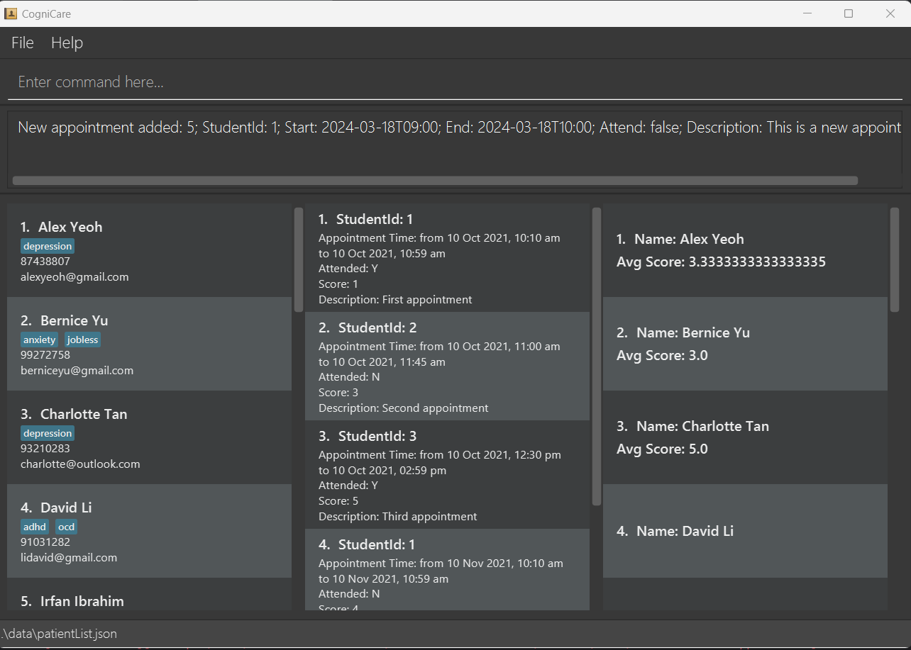

# CogniCare User Guide

CogniCare is a **desktop app for a single-user application for managing most School of Computing (SoC) patients, optimized for use via a Command Line Interface** (CLI) while still retaining all the benefits of a Graphical User Interface (GUI). For fast-typers, CogniCare can get your patient management tasks done faster than other traditional GUI apps.

<!-- * Table of Contents -->


<page-nav-print />

--------------------------------------------------------------------------------------------------------------------

## Quick start

1. Ensure you have Java `11` or above installed on your Computer.
    1. If you are on macOS on an Apple Silicon System, we recommend that you follow the guide on [CS2103 Course website](https://nus-cs2103-ay2324s2.github.io/website/admin/programmingLanguages.html#programming-language) using the Zulu version `zulu11.50.19-ca-fx-jdk11.0.12-macosx_aarch64.dmg`


2. Download the latest `cognicare.jar` from [here](https://github.com/AY2324S2-CS2103-F08-2/tp/releases).

3. Copy the file to the folder you want to use as the _home folder_ for your CogniCare application.

4. Open a command terminal, `cd` into the folder you put the jar file in, and use the `java -jar cognicare.jar` command to run the application.<br>
   A GUI similar to the one below should appear in a few seconds. Note how the app contains some sample data.<br>
   

5. Type the command in the command box and press Enter to execute it. e.g., typing **`help`** and pressing Enter will open the help window.<br>
   Some example commands you can try:


    * `edita 1 pid/3` : Changes appointment index 1, from its original patient id to patient id 3.

    * `queryp` : Lists all patients that are stored in the CogniCare application.

    * `addp n/Jerome Chua p/98765432 e/jerome@example.com a/depression` : Adds a contact named `Jerome Chua` to the Address Book who is affiliated with having "depression".

    * `deletep 903` : Deletes the patient that has the id of 903 (This is different from the natural ordering of the list).
   
    * `adda pid/1 sd/2022-12-12 12:00 ed/2022-12-12 13:00 att/true s/5 ad/This is a dummy appointment` : Adds an appointment for patient index 1 to the address book from 12pm to 1pm on 12 December 2022.
   
    * `querya` : Lists all appointments that are stored in CogniCare.

    * `querya pid/2` : List all appointments belonging to patient index 2 that is stored in the CogniCare application.

    * `deletea 3` : Deletes the appointment that has the appointment id of 3 (This is different from the natural ordering of the list).

    * `clear` : Deletes all patient and appointment information from the CogniCare application.

    * `exit` : Exits the app.


6. Refer to the [Features](#features) below for details of each command.

--------------------------------------------------------------------------------------------------------------------
## Overview of GUI

The CogniCare application has three columns displaying (from left to right) patient data, appointment data, and the average feedback score per patient.


(From the left) the first column displays patient details stored in CogniCare. For each patient, their full name, affiliated tags, phone number, and email will be displayed. 


The second column displays appointment details stored in CogniCare. For each appointment, the name of the patient who requested the appointment, appointment timing, and notes will be displayed.
Additionally, it will display `Attended` if the patient has attended the appointment and the given feedback score. `N/A` is displayed if the feedback score is unavailable.


Lastly, the third column displays the name and average feedback score per patient.


--------------------------------------------------------------------------------------------------------------------
## Features

<box type="info" seamless>

**Notes about the command format:**<br>

* Words in `UPPER_CASE` are the parameters to be supplied by the user.<br>
  e.g., in `addp n/NAME`, `NAME` is a parameter that can be used as `add n/John Doe`.

* Items in square brackets are optional.<br>
  e.g. `n/NAME [a/AFFLIATED_WITH]` can be used as `n/Jerome a/depression` or as `n/Jerome`.

* Items with `…`​ after can be used multiple times including zero times.<br>
  e.g. `[a/AFFLIATED_WITH]…​` can be used as ` ` (i.e., 0 times), `a/depressed`, `a/jobless a/sad` etc.

* Parameters can be in any order.<br>
  e.g., if the command specifies `n/NAME p/PHONE_NUMBER`, then `p/PHONE_NUMBER n/NAME` is also acceptable.

* Extraneous parameters for commands that do not take in parameters (such as `help`, `exit`, and `clear`) will be ignored.<br>
  e.g. if the command specifies `help 123`, it will be interpreted as `help`.

* If you are using a PDF version of this document, please be careful when copying and pasting commands that span multiple lines as space characters surrounding line breaks may be omitted when copied over to the application.
  </box>

### Viewing help : `help`

Shows a message explaining how to access the help page.


Format: `help`


### Adding a patient: `addp`

Add a patient to the CogniCare application.

Format: `addp n/NAME p/PHONE_NUMBER e/EMAIL [a/AFFLIATED_WITH]…​`

The following image shows when the command is valid:

The image below shows a successful addition of a patient.


The image below shows a failure to add a patient due to a missing phone tag.


The image below shows a failure to add a patient due to a duplicate email tag.


**Validation**:
1. NAME
    1. No duplicate names are allowed. Names are lowercased and trimmed before duplicate comparison. Names are trimmed, both inner and outer whitespace. This means that `  Khang Hou` and `khang    hou  ` are both treated as the same name
    2. Please note that special characters are not allowed in this iteration (So, for example, "Jerome S/O Gary" will not be a valid name)
    3. Please note that only English names are allowed at this point, as all Singaporean residents/visitors are expected to have an English version of their name.

> Remark:
> It is important to note that Singapore names are only allowed to be **54-characters** in length. [Read More](https://www.asiaone.com/singapore/new-name-new-me-more-opt-change). The reason why we allow an extended input (>54 characters) is because some exchange students may choose to have a nickname appended to their official name. Hence, the front part of the name would not be hidden in the GUI.


2. PHONE_NUMBER - We accept only Singaporean numbers as this is an application meant for a Singapore-specific context
    1. Should be exactly 3 or 8 digits long which is in a Singaporean phone number format. (For example: 82221234, 91112222, and 999 are valid phone numbers)
    2. Should start with 6, 8 or 9. (We ignore 3 since those are IP Phone Numbers that people wouldn't normally have)
    3. Note: This simplistic validation allows for weird numbers like 666, but we allow this anyway since comprehensive number validation would be too technically complex
3. EMAIL
    1. Should be a valid email address with the form `local-part@domain` where the domain is at least 2 letters long
    2. All emails are stored in lowercase by default.
    3. It is important to note that email validation is not very strict and allows for flexibility in the local-part and domain formats.
4. AFFILIATED_WITH
    1. There can be many AFFILIATED_WITH tags specified.
    2. Each AFFILIATED_WITH tag should be a **single word**, contain only alphanumerical, and should not be empty.

<box type="tip" seamless>

**Tip:** A patient can have any number of affiliations (including 0)
</box>

Examples:
* `addp n/Jerome Chua p/98765432 e/jerome@example.com a/depression`
* `addp n/Davinci Lim p/98731122 e/betsycrowe@example.com a/sad a/anxiety`


<box type="tip" seamless>

**Tip:** Once the patient is created, the patient identifier `pid` will be permanently tagged to a patient,
and is not coalesced when other entries are deleted.
This is similar to SQL database behaviour where the auto-increment primary key goes on to the next value even if the transaction has failed. [Read more](https://stackoverflow.com/questions/10108593/mysql-autoincrement-value-increases-even-when-insertion-fails-due-to-error)

This means that if the CogniCare application initially contained the patients
```
1. Caitlyn
2. Khang Hou
3. Jerome
```

When Khang Hou (Patient ID 2) is deleted, the patient ids are as below:

```
1. Caitlyn
3. Jerome
```

</box>

<box type="tip" seamless>

**Second Tip:** You may not add two patients with the same name even if they are in a different case and different whitespace (i.e. "DAVINCI    Lim" vs "Davinci Lim").
</box>


### Listing all patients : `queryp`

Shows a list of all patients in the CogniCare application.

The image shows the successful `queryp` command


### Listing selected patients that meet specified criterion / criteria : `queryp`

Shows a list of all patients in the CogniCare application that matches the criteria.

Format: `queryp [n/NAME] [p/PHONE_NUMBER] [e/EMAIL] [a/AFFLIATED_WITH]…​`

* Case-Insensitive, partial search: The queryp command supports partial matching for the "Name", "Phone Number", and "Email" fields, allowing for flexibility in executing search queries. This means the `queryp` command can find entries that contain the specified pattern anywhere within these fields, regardless of whether the letters are uppercase or lowercase. However, it is important to note that partial matching is not supported for Tags.
* Search Logic:
  * AND Logic for Different Criteria: When different criteria are used in a single `queryp` command (e.g., name, phone number, email), CogniCare will return the list of patients that meets all those criteria. For example, when you search for a patient with a specific name, phone number, and email address, only patients who match all these details will be shown in the results.
  * OR Logic for Tags: However, when you specify more than one tag in the command, the application interprets this as an OR condition. This means CogniCare will return the list of patients who have any of the tags specified. For example, using `queryp a/depression a/anxiety` will return the list of patients who are tagged with either depression or anxiety (or both).


The image shows the successful `queryp` command with all parameters specified.


For example, to find all the "Jerome" that are stored in the CogniCare application, the user may use the command
Format: `queryp n/Jerome …​`
This searches for any patient whose name contains "Jerome", regardless of case. So, it will find "JEROME", "jerome", "Jerome", etc.

The image shows the successful `queryp` command.


For example, to find all the "Jerome"-s that are stored in the CogniCare application, have a phone number that contains 987, and containing the domain "example.com"; the user may use the command
Format: `queryp n/Jerome p/987 e/example.com ​`

The user may also choose to use the command in the following way to view students that have either `depression` OR `anxiety` tag.
Format: `queryp a/depression a/anxiety ​`


For example, to find all the "rome"-s that are stored in the CogniCare application.
Format: `queryp n/rome ​`

Then all patients with "rome" in their names will be returned as well. Similar logic applies for Name, Phone Number and Email address, but not for the affiliated-with tags.

### Viewing the top 10 distinct affiliated-with tags
> **Note**: You **_do not_** need to enter any command to access this information. These top 10 statistics are automatically updated.

The image shows the (top 10) most popular tags sorted by how many patients with that respective affiliated-with tags.
Note that the command was entered to demonstrate that the count for the anxiety tag is the same as the ones in the CogniCare application.


### Editing a patient : `editp`

Edit an existing patient in the CogniCare application at the specified index.

Format: `editp PATIENT_ID [n/NAME] [p/PHONE] [e/EMAIL] [a/AFFLIATED_WITH]…​`

* Edits the patient at the specified `PATIENT_ID`. The index refers to the unique identifier number shown in the displayed patient list. The index **must be a positive integer** 1, 2, 3, …​

<box type="tip" seamless>

**Tip:** Please take note that 0 is not a valid patient identifier.
</box>

* At least one of the optional fields must be provided.
* Existing values will be updated to the input values.
* When editing affiliated-with tags, the existing affiliated-with tags of the patient will be removed; i.e., adding of affiliated-with tags is not cumulative.
* The `patientId` will not be changed when you edit an individual's information.
* You can remove all the patient’s affiliated-with tags by typing `a/` without
  specifying any affiliated-with tags after it.


<box type="tip" seamless>

**Tip:** Changing the patient's name does not automatically update the Appointment's patient names.
Run `querya` to update the appointments with new information.
</box>


<box type="tip" seamless>

**Tip:** Please make sure that you only edit the patients that are visible to you on the GUI. The same applies for the Appointments.
</box>

Examples:
*  `editp 1 p/91234567 e/johndoe@example.com` Edits the phone number and email address of the patient with index 1 to be `91234567` and `johndoe@example.com` respectively.
*  `editp 2 n/Betsy Crower a/` Edits the name of the patient with index 2 to be `Betsy Crower` and clears all existing tags.

The image below shows a successful message of an edit patient command.


The image below shows a failed message of an edit patient command (when an invalid index is specified).


The image below shows a failed message of an edit patient command (when no index is specified).


### Deleting a patient : `deletep`

Delete the specified patient from the address book from the specified patient index.

Format: `deletep INDEX`

* Deletes the patient at the specified `INDEX`.
* The index refers to the index number shown in the displayed patient list.
* The index **must be a positive integer** 1, 2, 3, …​

Examples:
* `queryp` followed by `deletep 90` deletes the patient with the patientId of 90 in the CogniCare application.


The image below shows a successful message of a delete patient command (when a valid index is specified).


The output failed message of a delete patient command (when no index or invalid index is specified) is similar to when the edit command fails.


### Adding an appointment: `adda`

Adds an appointment to the CogniCare application.

Format: `adda pid/PATIENT_ID sd/START_DATETIME ed/END_DATETIME [att/ATTEND] [s/FEEDBACK_SCORE] [ad/APPOINTMENT_DESCRIPTION]`

* Format of date time is yyyy-MM-dd HH:mm.
* Once the patient is created, the appointment identifier `aid` will be permanently tagged to an appointment, and is not coalesced when other entries are deleted.
* You may not add two appointments with the same date and time even if they are for different patients.
* FEEDBACK_SCORE refers to the rating that the patient gives at the end of each appointment. This score represents their satisfaction levels. The higher the satisfaction level, the better.
* APPOINTMENT_DESCRIPTION refers to any appointment notes the user wishes to note down.

Examples:
* `adda pid/1 sd/2024-12-12 12:00 ed/2024-12-12 13:00` adds an appointment for the patient with patient index 1 on 12 December 2024 from 12pm to 1pm.
* `adda pid/1 sd/2024-12-12 13:00 ed/2024-12-12 14:00 s/5` adds an appointment for the patient with patient index 1 on 12 December 2024 from 1pm to 2pm with a feedback score of 5.
* `adda pid/1 sd/2024-12-12 14:00 ed/2024-12-12 15:00 att/true s/1 ad/Patient attended the appointment.` adds an appointment for the patient with patient index 1 on 12 December 2024 from 2pm to 3pm
with an attended status `true`, feedback score of 1 and an appointment description.

The screenshot below shows a successful operation:


The screenshot below shows a failed operation due to another appointment being scheduled for the same date and time:


**Validation**:
1. PATIENT_ID
   1. No non-existing patient IDs are allowed. Checks are made against the patient list.
   2. The patient ID given must exist in the current patient list.
   3. Patient ID must be a positive integer.
2. START_DATETIME and END_DATETIME
   1. No two appointments can share the exact same date and time, even if they differ by other attributes like different patient IDs.
      - Note the exception to this is when the appointment's start and end times are tbe same as we allow boundary values to be touching each other, as long as they're not crossing each other.
   2. END_DATETIME must be after START_DATETIME.
1. ATTEND
   1. Must be either `true` or `false` (case-insensitive).
2. FEEDBACK_SCORE
   1. The score must be an integer between 1 and 5 (inclusive).

### Listing all appointments: `querya`

Shows a list of all appointments in CogniCare.

The screenshot below shows a successful query of all appointments:


### Listing selected appointments that meet specified criteria: `querya`

Shows a list of appointments in the CogniCare application that matches the criteria.

Format: `querya [pid/PATIENT_ID] [n/PATIENT_NAME] [aid/APPOINTMENT_ID]`

Examples:
* `querya pid/1` shows all appointments for the patient with the patient id of 1 in the CogniCare application.
* `querya aid/4` shows the appointment with the appointmentId of 4 in the CogniCare application.
* `querya n/Tan` shows all appointments whose patient's name contains "Tan" in the CogniCare application.

The screenshot below shows a successful query of appointments using patient id:


### Filter appointments by date time: `filter`

Show a list of appointments in a specific date and time range. This includes the appointments that start or end in the date time range or appointments that start before and end after the date time range.

Format: `filter [sd/START_DATETIME] [ed/END_DATETIME]`

Both `START_DATETIME` and `END_DATETIME` are optional. If only `START_DATETIME` is provided, all appointments that end on or after the `START_DATETIME` will be shown. If only `END_DATETIME` is provided, all appointments that start on or before the `END_DATETIME` will be shown.

Examples:
* `filter sd/2022-12-12 12:00 ed/2022-12-12 14:00` shows all appointments that start or end in the date time range of 12pm to 2pm on 12 December 2022. 
* `filter sd/2022-12-12 12:00` shows all appointments that end on or after 12pm on 12 December 2022. 
* `filter ed/2022-12-12 14:00` shows all appointments that start on or before 2pm on 12 December 2022. 

**Validation**:
1. START_DATETIME and END_DATETIME
   1. Must be in the format of yyyy-MM-dd HH:mm.
   2. END_DATETIME must be after START_DATETIME.

The screenshot below shows a successful filter appointment command using both date time range:


The screenshots below show a successful filter appointment command using one date time range:


The screenshot below shows an unsuccessful filter appointment command due to invalid date time range:


### Editing an appointment: `edita`

Edit an appointment in CogniCare using the specified appointment index.

Format: `edita APPOINTMENT_ID [pid/PATIENT_ID] [sd/START_DATETIME] [ed/END_DATETIME] [att/ATTEND] [s/FEEDBACK_SCORE] [ad/APPOINTMENT_DESCTIPTION]`

* Edits the appointment at the specified `APPOINTMENT_ID`. The index refers to the index number shown in the displayed appointment list. The index **must be a positive integer** 1, 2, 3, …​
* At least one of the optional fields must be provided.
* Existing values will be updated to the input values.
* The `APPOINTMENT_ID` will not be changed when you edit the appointment's information.

Examples:
* `edita 1 pid/2` edits the appointment with appointment index 1 with patient id 2.
* `edita 1 sd/2021-10-10 10:00` edits the start date and time of the appointment with appointment index 1 to 10am, 10 October 2021.
* `edita 1 att/false` edits the attended status of the appointment with appointment index 1 to false.


### Deleting an appointment : `deletea`

Delete the specified appointment from the CogniCare application using the specified appointment index.

Format: `deletea INDEX`

* Deletes the appointment at the specified `INDEX`.
* The index refers to the index number shown in the displayed appointment list.
* The index **must be a positive integer** 1, 2, 3, …​

Examples:
* `deletea 3` deletes the appointment with the appointmentId of 3 in the address book.

The screenshot below shows a successful operation:


The screenshot below shows a failed operation due to invalid appointment index:


### Reporting Patient Feedback Statistics: `reportf`

Shows the average feedback score per patient for all appointments given a specified date range.

Format: `reportf [sd/START_DATE] [ed/END_DATE]`

- `sd/` filters all appointments that end on or after START_DATE
- `ed/` filters all appointments that start on or before END_DATE
- Note that`sd/` and `ed/` expect dates and not datetimes
- By default, if either `sd/` or `ed/` are left blank, their values will default to the minimum and maximum datetime respectively

**Examples**
1. `reportf` - Generates a report using all appointments

1. `reportf sd/2024-02-18` - Generates a report with all appointments that start on or before 18 Feb 2024 00:00

1. `reportf ed/2024-02-20` - Generates a report with all appointments that end on or before 20 Feb 2024 23:59

1. `reportf sd/2024-02-18 ed/2024-02-20` - Generates a report with all appointments that start on 18 Feb 2024 and end before 20 Feb 2024.


**Notes**
1. When filtering using `reportf`, the appointment list is also filtered. This is the intended behaviour because the patient feedback report data is entirely dependent on the Patient and Appointment lists.
2. `reportf` allows for loose date ranges. E.g., there is an appointment from 18 Feb to 20 Feb 2024. Calling `reportf sd/2024-02-19 ed/2024-02-21` will include this report.

### Clearing all entries : `clear`

Clears all entries from the CogniCare application.

Format: `clear`

### Exiting the program : `exit`

Exit the program.

Format: `exit`

### Saving the data

CogniCare data is saved in the hard disk automatically after any command that changes the data. There is no need to save manually.

### Editing the data file

CogniCare data is saved automatically as a JSON file `[JAR file location]/data/patientList.json` and `[JAR file location]/data/appointmentList.json`. Advanced users are welcome to update data directly by editing that data file.

<box type="warning" seamless>

**Caution:**
If your changes to the data file make its format invalid, CogniCare will discard all data and start with an empty data file at the next run.  Hence, it is recommended to take a backup of the file before editing it.<br>

Furthermore, certain edits can cause the CogniCare application to behave in unexpected ways (e.g. if a value entered is outside the acceptable range). Especially, **do not** put `null` anywhere in any of the JSON files as it will cause the app to not be able to launch. Therefore, edit the data file only if you are confident that you can update it correctly.
</box>

### Navigating through the history of successful commands
Press `UP` or `DOWN` keyboard key to navigate your history of successful commands. 

- UP - Goes to the previous command in the history
- DOWN - Goes to the next command in the history

Note: Upon reaching the start of the command history, pressing UP further will play a sound to indicate this fact


--------------------------------------------------------------------------------------------------------------------

## Frequently Asked Questions (FAQ)

**Q**: How do I transfer my data to another Computer?<br>
**A**: Install the app on the other computer and overwrite the empty data file it creates with the file that contains the data of your previous CogniCare home folder.

**Q**: Why are developers so cute and smart?<br>
**A**: Thanks :thumbsup:

--------------------------------------------------------------------------------------------------------------------

## Known issues

1. **When using multiple screens**, if you move the application to a secondary screen, and later switch to using only the primary screen, the GUI will open off-screen. The remedy is to delete the `preferences.json` file created by the application before running the application again.
2. Students and Patients are terms used interchangeably.

--------------------------------------------------------------------------------------------------------------------

## Command summary

| Action                                                | Format, Examples                                                                                                                                                                                                                 |
|-------------------------------------------------------|----------------------------------------------------------------------------------------------------------------------------------------------------------------------------------------------------------------------------------|
| **Add a patient**                                     | `addp n/NAME p/PHONE_NUMBER e/EMAIL [a/AFFLIATED_WITH]…​` <br> e.g., `addp n/Jerome Chua p/98765432 e/jerome@example.com a/depression` or `addp n/Davinci Lim p/98731122 e/betsycrowe@example.com a/sad a/anxiety`               |
| **Query patients**                                    | `queryp [n/NAME] [p/PHONE_NUMBER] [e/EMAIL] [a/AFFLIATED_WITH]…​`<br> e.g., `queryp n/Jerome p/987 e/example.com​`                                                                                                               |
| **Delete patient**                                    | `deletep PATIENT_ID`<br> e.g., `deletep 3`                                                                                                                                                                                       |
| **Edit patient**                                      | `editp PATIENT_ID [n/NAME] [p/PHONE_NUMBER] [e/EMAIL] [a/AFFLIATED_WITH]…​`  <br> e.g., `editp 1 p/91234567 e/johndoe@example.com`                                                                                               |
| **Add an appointment**                                | `adda pid/PATIENT_ID sd/START_DATETIME ed/END_DATETIME [att/ATTEND] [s/FEEDBACK_SCORE] [ad/APPOINTMENT_DESCRIPTION]` <br> e.g., `adda pid/2 sd/2022-12-12 15:00 ed/2022-12-12 16:00 att/true s/5 ad/This is a dummy appointment` |
| **Query appointments**                                | `querya [pid/PATIENT_ID] [n/PATIENT_NAME] [aid/APPOINTMENT_ID]` <br> e.g., `querya pid/2`                                                                                                                                        |
| **Delete an appointment**                             | `deletea APPOINTMENT_ID` <br> e.g., `deletea 1`                                                                                                                                                                                  | 
| **Edit an appointment**                               | `edita APPOINTMENT_ID [pid/PATIENT_ID] [sd/START_DATETIME] [ed/END_DATETIME] [att/ATTEND] [s/FEEDBACK_SCORE] [ad/APPOINTMENT_DESCRIPTION]` <br> e.g., `edita 1 pid/2`                                                            |
| **Filter appointments by date time**                  | `filter [sd/START_DATETIME] [ed/END_DATETIME]`  <br> e.g., `filter sd/2022-12-12 12:00`                                                                                                                                          |
| **Report patient feedback statistics**                | `reportf [sd/START_DATE] [ed/END_DATE]` <br> e.g. `reportf sd/2024-02-18`                                                                                                                                                                  |
| **Help**                                              | `help`                                                                                                                                                                                                                           |                                                                                                                                                                                                           |
| **Delete all entries from the CogniCare application** | `clear`                                                                                                                                                                                                                          |
| **Exit Application**                                  | `exit`                                                                                                                                                                                                                           |
