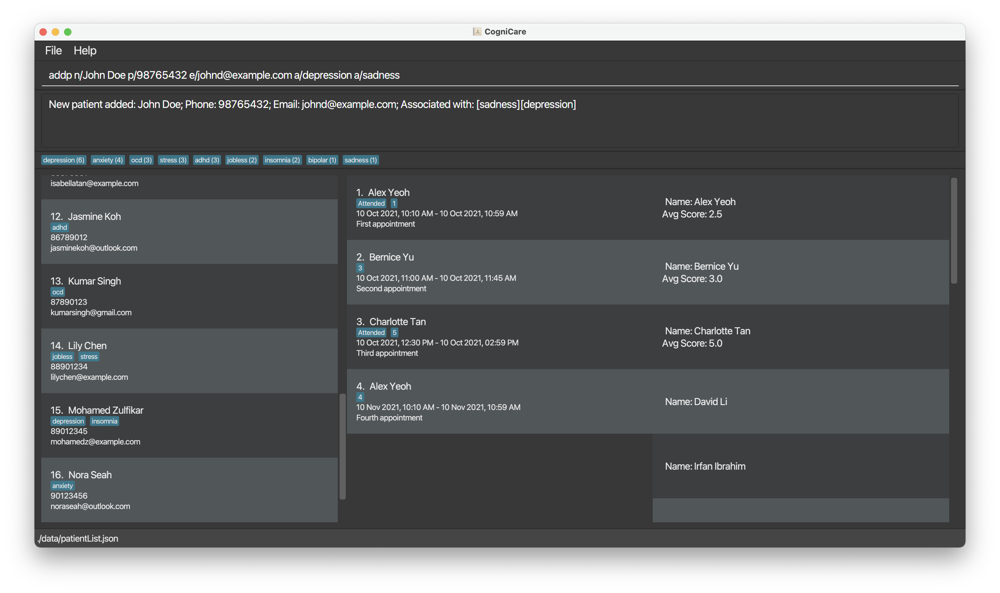
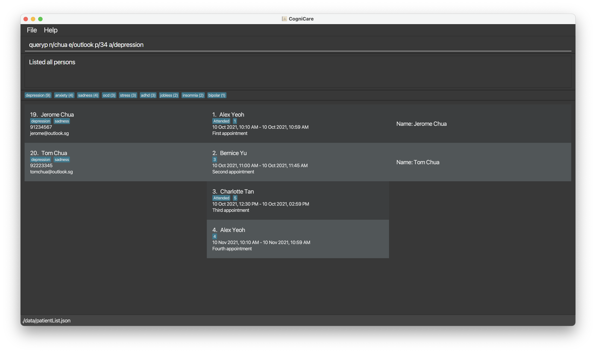
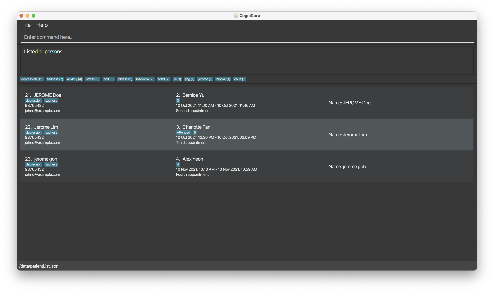
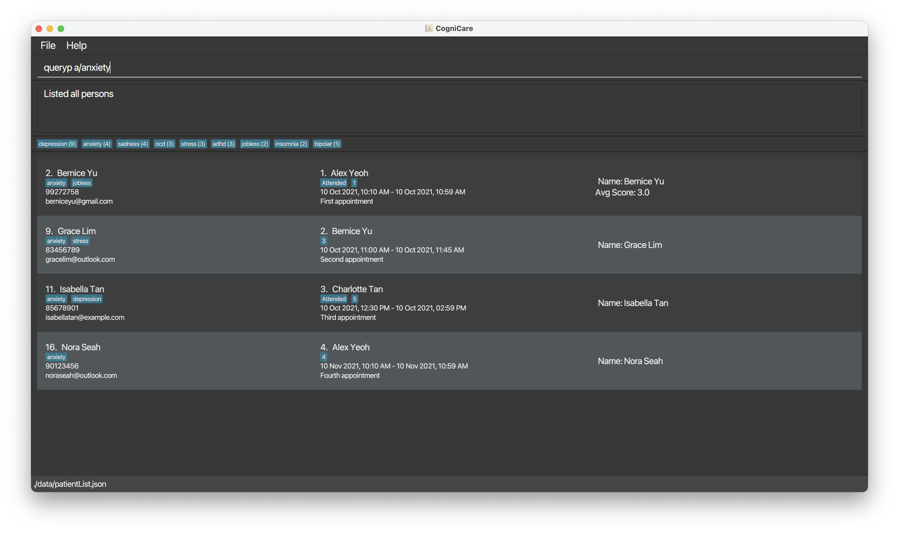
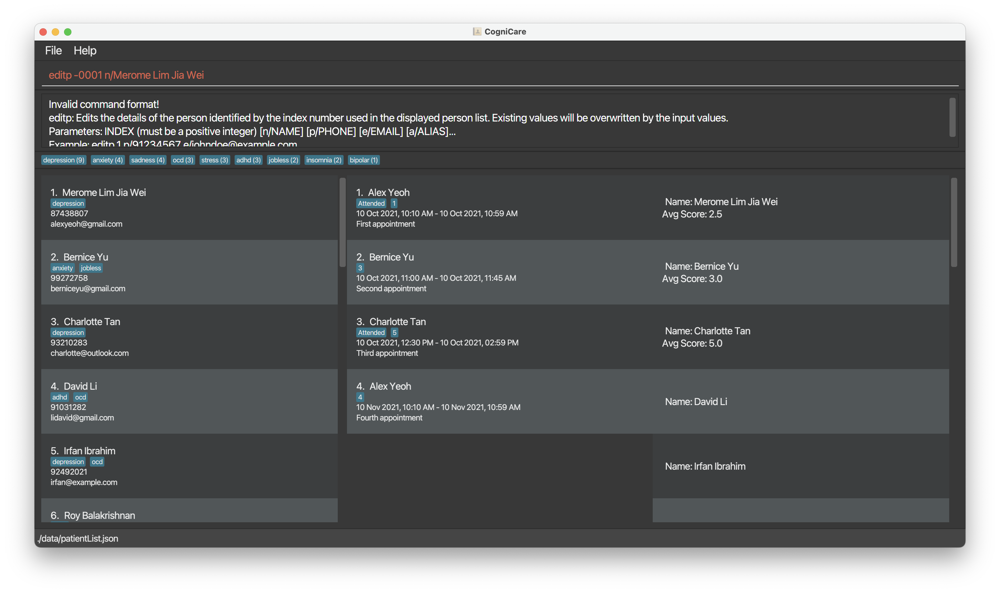
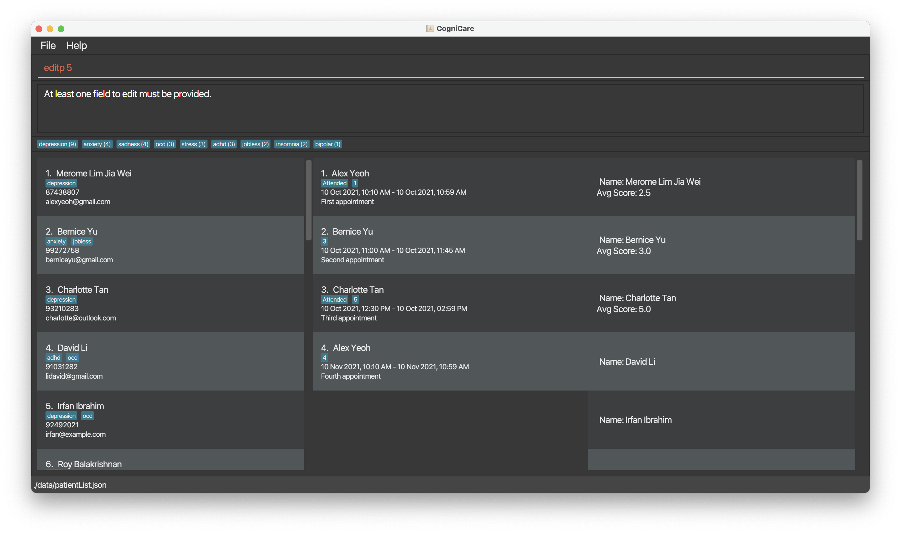
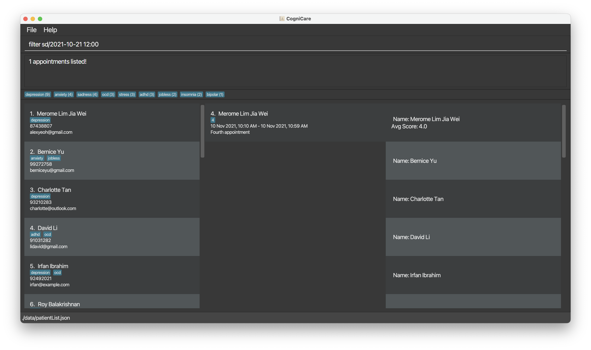

# CogniCare User Guide

CogniCare is a **desktop app for managing all patients, optimized for use via a Command Line Interface** (CLI) while still retaining all the benefits of a Graphical User Interface (GUI). If you can type fast, CogniCare can get your patient management tasks done faster than other traditional GUI apps.

<!-- * Table of Contents -->
<page-nav-print />

--------------------------------------------------------------------------------------------------------------------

## Quick start

1. Ensure you have Java `11` or above installed in your Computer.
    1. If you are on macOS on an Apple Silicon System, we recommend that you follow the guide on [CS2103 Course website](https://nus-cs2103-ay2324s2.github.io/website/admin/programmingLanguages.html#programming-language) using the Zulu version `zulu11.50.19-ca-fx-jdk11.0.12-macosx_aarch64.dmg`

2. Download the latest `cognicare.jar` from [here](https://github.com/AY2324S2-CS2103-F08-2/tp/releases).

3. Copy the file to the folder you want to use as the _home folder_ for your CogniCare application.

4. Open a command terminal, `cd` into the folder you put the jar file in, and use the `java -jar cognicare.jar` command to run the application.<br>
   A GUI similar to the below should appear in a few seconds. Note how the app contains some sample data.<br>
   

5. Type the command in the command box and press Enter to execute it. e.g. typing **`help`** and pressing Enter will open the help window.<br>
   Some example commands you can try:

    * `queryp` : Lists all patients that are stored in CogniCare.

    * `addp n/Jerome Chua p/98765432 e/jerome@example.com a/depressed` : Adds a contact named `Jerome Chua` to the Address Book who is associated with having depression.

    * `deletep 903` : Deletes the patient that has the id of 903 (This is different from the natural ordering of the list).
   
    * `adda pid/1 sd/2022-12-12 12:00 ed/2022-12-12 13:00 att/true s/5 ad/This is a dummy appointment` : Adds an appointment for patient index 1 to the address book from 12pm to 1pm on 12 December 2022.
   
    * `querya` : Lists all appointments that are stored in CogniCare.

    * `querya pid/2` : List all appointments belonging to patient index 2 that are stored in CogniCare.
   
    * `edita 1 pid/3` : Changes appointment index 1 with the patient id 3.

    * `deleteappointment 900` : Deletes the appointment that has the id of 900 (This is different from the natural ordering of the list).

    * `clear` : Deletes all patient information from the CogniCare application.

    * `exit` : Exits the app.

6. Refer to the [Features](#features) below for details of each command.

--------------------------------------------------------------------------------------------------------------------

## Features

<box type="info" seamless>

**Notes about the command format:**<br>

* Words in `UPPER_CASE` are the parameters to be supplied by the user.<br>
  e.g. in `addp n/NAME`, `NAME` is a parameter which can be used as `add n/John Doe`.

* Items in square brackets are optional.<br>
  e.g. `n/NAME [a/AFFLIATED_WITH]` can be used as `n/Jerome a/depression` or as `n/Jerome`.

* Items with `…`​ after them can be used multiple times including zero times.<br>
  e.g. `[a/AFFLIATED_WITH]…​` can be used as ` ` (i.e. 0 times), `a/depressed`, `a/jobless a/sad` etc.

* Parameters can be in any order.<br>
  e.g. if the command specifies `n/NAME p/PHONE_NUMBER`, `p/PHONE_NUMBER n/NAME` is also acceptable.

* Extraneous parameters for commands that do not take in parameters (such as `help`, `list`, `exit` and `clear`) will be ignored.<br>
  e.g. if the command specifies `help 123`, it will be interpreted as `help`.

* If you are using a PDF version of this document, please be careful when copying and pasting commands that span multiple lines as space characters surrounding line-breaks may be omitted when copied over to the application.
  </box>

### Viewing help : `help`

Shows a message explaining how to access the help page.


Format: `help`


### Adding a patient: `addp`


Adds a patient to the address book.

Format: `adda n/NAME p/PHONE_NUMBER e/EMAIL [a/AFFLIATED_WITH]…​`

The following image shows when command is valid:

The image below shows a successful addition of patient.


The image below a failure of adding student due to missing phone tag.


The image below a failure of adding student due to duplicate email tag.


**Validation**:
1. NAME
    1. No duplicate names are allowed. Names are lowercased and trimmed before duplicate comparison
2. PHONE_NUMBER
    1. Should be exactly 3 or 8 digits long
    2. Should start with 6, 8 or 9. (We ignore 3 since those are numbers that people wouldn't normally have)
    3. Note: This simplistic  validation allows for weird numbers like 666, but we allow this anyway since comprehensive number validating is too technically complex
3. EMAIL
    1. Should be a valid email address with the form `local-part@domain` where domain is at least 2 letters long
    2. All emails are stored in lowercase by default

<box type="tip" seamless>

**Tip:** A patient can have any number of affiliations (including 0)
</box>

Examples:
* `addp n/Jerome Chua p/98765432 e/jerome@example.com a/depression`
* `addp n/Davinci Lim p/98731122 e/betsycrowe@example.com a/sad a/anxiety`


<box type="tip" seamless>

**Tip:** Once the patient is created, the patient identifier `pid` will be permanently tagged to a patient,
and is not coalesced when other entries are deleted.
This is similar to SQL database behaviour where the auto-increment primary key goes on to the next value even if the transaction has failed. [Read more](https://stackoverflow.com/questions/10108593/mysql-autoincrement-value-increases-even-when-insertion-fails-due-to-error)

This means that if the CogniCare application initially contained of the items
```
1. Caitlyn
2. Khang Hou
3. Jerome
```

When Khang Hou is deleted, the patient ids are as below:

```
1. Caitlyn
3. Jerome
```

</box>

<box type="tip" seamless>

**Second Tip:** You may not add two patients with the same name even if they are in different case (i.e. "DAVINCI    Lim" vs "Davinci Lim").
</box>


### Listing all patients : `queryp`

Shows a list of all patients in the address book.

The image shows the successful `queryp` command


### Listing selected patients that meets specified criterion / criteria : `queryp`

Shows a list of all patients in the address book that matches _ALL_ the conditions that are specified.

Format: `queryp [n/NAME] [p/PHONE_NUMBER] [e/EMAIL] …​`

The image shows the successful `queryp` command with all parameters specified.



For example: to find all the "Jerome" that are stored in the CogniCare application, the user may use the command
Format: `queryp n/Jerome …​`

The image shows the successful `queryp` command with only one parameter (name) specified.



For example: to find all the "Jerome"s that are stored in the CogniCare application, have a phone number that contains 987, and email using outlook, the user may use the command

Format: `queryp n/Jerome p/987 e/example.com ​`


## Viewing statistics of tagged information
The image shows the (top 10) most popular tags sorted by how many patients with that respective tag.
Note that the command was entered to demonstrate that the count for the anxiety tag is the same as the ones in the CogniCare application.



### Editing a patient : `editp`

Edits an existing patient in the address book.

Format: `editp PATIENT_ID [n/NAME] [p/PHONE] [e/EMAIL] [a/ADDRESS] [a/AFFLIATED_WITH]…​`

* Edits the patient at the specified `addp_ID`. The index refers to the index number shown in the displayed patient list. The index **must be a positive integer** 1, 2, 3, …​
* At least one of the optional fields must be provided.
* Existing values will be updated to the input values.
* When editing tags, the existing tags of the patient will be removed; i.e. adding of tags is not cumulative.
* The `patientId` will not be changed when you edit an individual's information.
* You can remove all the patient’s tags by typing `a/` without
  specifying any tags after it.

Examples:
*  `editp 1 p/91234567 e/johndoe@example.com` Edits the phone number and email address of the 1st patient to be `91234567` and `johndoe@example.com` respectively.
*  `editp 2 n/Betsy Crower a/` Edits the name of the 2nd patient to be `Betsy Crower` and clears all existing tags.

The image belows shows a successful message of an edit patient command.


The image belows shows a failed message of an edit patient command (when an invalid index is specified).


The image belows shows a failed message of an edit patient command (when no index is specified).



### Deleting a patient : `deletep`

Deletes the specified patient from the address book from the specified patient index.

The image belows shows a successful message of a delete patient command (when no index is specified).


The output failed message of a delete patient command (when no index or invalid index is specified) is similar to when the edit command fails.


Format: `deletep INDEX`

* Deletes the patient at the specified `INDEX`.
* The index refers to the index number shown in the displayed patient list.
* The index **must be a positive integer** 1, 2, 3, …​

Examples:
* `list` followed by `deletep 90` deletes the patient with the patientId of 90 in the address book.

### Adding an appointment: `adda`

Adds an appointment to the address book.

Format: `adda pid/PATIENT_ID sd/START_DATE_TIME ed/END_DATE_TIME [att/ATTEND] [s/SCORE] [ad/APPOINTMENT_DESCRIPTION]`

* Format of date time is yyyy-MM-dd HH:mm.
* Once the patient is created, the appointment identifier `aid` will be permanently tagged to an appointment, and is not coalesced when other entries are deleted.
* You may not add two appointments with the same date and time even if they are for different patients.
* SCORE refers to the rating that the patient gives at the end of each appointment. This score represents their satisfaction levels. The higher satisfaction level, the more likely they are to be discharged

Examples:
* `appointment pid/1 d/2022-12-12 12:00`
* `appointment pid/1 d/2022-12-12 13:00 att/false`
* `appointment pid/1 d/2022-12-12 14:00 att/true ad/Patient attended the appointment.`

The screenshot below shows a successful operation:


The screenshot below shows a failed operation due to another appointment being scheduled for the same date and time:


**Validation**:
1. PATIENT_ID
   1. No non-existing patient IDs are allowed. Checks are made against the patient list
   2. Patient ID given must exist in the current patient list.
   3. Patient ID must be a positive integer.
2. DATE_TIME
   1. No two appointments can share the exact same date and time, even if they differ by other attributes like different patient IDs
   2. The start date and time cannot be before the end date and time.
3. ATTEND
   1. Must be either `true` or `false` (case-insensitive)
4. SCORE
   1. The score must be between 1 and 5 (inclusive).

### Listing all appointments: `querya`

Shows a list of all appointments in CogniCare. Can be filtered by multiple criteria.


Format: `querya [pid/PATIENT_ID] [n/PATIENT_NAME] [aid/APPOINTMENT_ID]`

Examples:
* `querya` shows all appointments in the address book.
* `querya pid/1` shows all appointments for the patient with the patientId of 1 in the address book.
* `querya aid/90` shows the appointment with the appointmentId of 90 in the address book.
* `querya n/Jer` shows all appointments whose patient's name contains "Jer" in the address book.

The screenshot below show a successful query of all appointments:


The screenshot below show a successful query of appointments using patient id:


### Filter appointments by date time: `filter`

Show list of appointments in a specific date time range. This includes the appointments that starts or ends in the date time range or appointments that starts before and ends after the date time range.

Format: `filter [sd/START_DATETIME] [ed/END_DATETIME]`

Both `START_DATETIME` and `END_DATETIME` are optional. If only `START_DATETIME` is provided, all appointments that starts on or after the `START_DATETIME` will be shown. If only `END_DATETIME` is provided, all appointments that ends on or before the `END_DATETIME` will be shown.

Examples:
* `filter sd/2022-12-12 12:00 ed/2022-12-12 14:00` shows all appointments starts or ends in the date time range of 12pm to 2pm on 12 December 2022. Any appointments that starts before 12pm and ends after 2pm will also be shown.
* `filter sd/2022-12-12 12:00` shows all appointments that starts on or after 12pm on 12 December 2022.
* `filter ed/2022-12-12 14:00` shows all appointments that ends on or before 2pm on 12 December 2022.
* `filter` shows all appointments in the address book.

**Validation**:
1. START_DATETIME and END_DATETIME
   1. Must be in the format of yyyy-MM-dd HH:mm.
   2. END_DATETIME must be after START_DATETIME.

The screenshot below show a successful filter appointments using both date time range:


The screenshots below show a successful filter appointments using one date time range:



The screenshot below show a unsuccessful filter appointments due to invalid date time range:


### Editing an appointments: `edita`

Edits an appointment in CogniCare using the specified appointment index.

Format: `edita APPOINTMENT_INDEX [pid/PATIENT_ID] [sd/START_DATE_TIME] [ed/END_DATE_TIME] [att/ATTEND] [s/SCORE] [ad/APPOINTMENT_DESCTIPTION]`

* Edits the appointment at the specified `APPOINTMENT_ID`. The index refers to the index number shown in the displayed appointment list. The index **must be a positive integer** 1, 2, 3, …​
* At least one of the optional fields must be provided.
* Existing values will be updated to the input values.
* The `APPOINTMENT_ID` will not be changed when you edit an appointment's information.

Examples:
* `edita 1 pid/1` edits the appointment with appointment index 1 with patient id 2.
* `edita 1 sd/2024-04-01 10:00` edits the start date and time of the appointment with appointment index 1 to 10am, 1 April 2024.
* `edita 1 att/true` edits the attended status of the appointment with appointment index 1 to true.


### Deleting an appointment : `deletea`

Deletes the specified appointment from the address book using the specified appointment index.

Format: `deletea INDEX`

* Deletes the appointment at the specified `INDEX`.
* The index refers to the index number shown in the displayed appointment list.
* The index **must be a positive integer** 1, 2, 3, …​

Examples:
* `querya` followed by `deletea 90` deletes the appointment with the appointmentId of 90 in the address book.

The screenshot below show a successful operation:


The screenshot below show a failed operation due to invalid appointment index:


### Reporting Patient Feedback Statistics: `reportf`

Shows the average feedback score per patient for all appointments given a specified date range.

Format: `reportf [sd/DATE] [ed/DATE]`

- Note that`sd/` and `ed/` expect dates and not datetimes
- By default, if either `/sd` or `/ed` are left blank, their values will default to the minimum and maximum datetimes respectively

**Examples**
1. `reportf` - Generates a report using all appointments

1. `reportf sd/2024-02-18` - Generates a report with all appointments that start from 18 Feb 2024

1. `reportf ed/2024-02-20` - Generates a report with all appointments that end before 20 Feb 2024

1. `reportf sd/2024-02-18 ed/2024-02-20` - Generates a report with all appointments that start from 18 Feb 2024 and end before 20 Feb 2024.


**Notes**
1. When filtering using `reportf`, the appointments list is also filtered. This is intended behaviour because the patient feedback report data is entirely dependent on the Patient and Appointment lists.
2. `reportf` allows for loose date ranges. E.g. there is an appointment from 18 Feb to 20 Feb 2024. Calling `reportf sd/2024-02-19 ed/2024-02-21` will include this report.

### Clearing all entries : `clear`

Clears all entries from the CogniCare application.

Format: `clear`

### Exiting the program : `exit`

Exits the program.

Format: `exit`

### Saving the data

CogniCare data is saved in the hard disk automatically after any command that changes the data. There is no need to save manually.

### Editing the data file

CogniCare data is saved automatically as a JSON file `[JAR file location]/data/patientList.json` and `[JAR file location]/data/appointmentList.json`. Advanced users are welcome to update data directly by editing that data file.

<box type="warning" seamless>

**Caution:**
If your changes to the data file makes its format invalid, CogniCare will discard all data and start with an empty data file at the next run.  Hence, it is recommended to take a backup of the file before editing it.<br>
Furthermore, certain edits can cause the CogniCare to behave in unexpected ways (e.g., if a value entered is outside the acceptable range). Therefore, edit the data file only if you are confident that you can update it correctly.
</box>

### Navigating through history of commands
Press UP or DOWN to navigate your history of written commands. 

UP - Goes to the previous command in the history
DOWN - Goes to the next command in the history

Note: Upon reaching the start of the history, pressing UP further will play a sound to indicate this fact


### Archiving data files `[coming in v2.0]`

_Details coming soon ..._


--------------------------------------------------------------------------------------------------------------------

## FAQ

**Q**: How do I transfer my data to another Computer?<br>
**A**: Install the app in the other computer and overwrite the empty data file it creates with the file that contains the data of your previous CogniCare home folder.

--------------------------------------------------------------------------------------------------------------------

## Known issues

1. **When using multiple screens**, if you move the application to a secondary screen, and later switch to using only the primary screen, the GUI will open off-screen. The remedy is to delete the `preferences.json` file created by the application before running the application again.

--------------------------------------------------------------------------------------------------------------------

## Command summary

| Action                                                | Format, Examples                                                                                                                                                                                                   |
|-------------------------------------------------------|--------------------------------------------------------------------------------------------------------------------------------------------------------------------------------------------------------------------|
| **Add a patient**                                     | `addp n/NAME p/PHONE_NUMBER e/EMAIL [a/AFFLIATED_WITH]…​` <br> e.g., `addp n/Jerome Chua p/98765432 e/jerome@example.com a/depression` or `addp n/Davinci Lim p/98731122 e/betsycrowe@example.com a/sad a/anxiety` |
| **Query patients**                                    | `queryp [n/NAME] [p/PHONE_NUMBER] [e/EMAIL] …​`<br> e.g., `queryp n/Jerome p/987 e/example.com​`                                                                                                                   |
| **Delete patient**                                    | `deletep PATIENT_ID`<br> e.g., `deletep 3`                                                                                                                                                                         |
| **Edit patient**                                      | `editp PATIENT_ID [n/NAME] [p/PHONE_NUMBER] [e/EMAIL] [a/AFFLIATED_WITH]…​`editp 1 p/91234567 e/johndoe@example.com`                                                                                               |
| **Add an appointment**                                | `adda pid/PATIENT_ID d/DATE_TIME [att/ATTEND] [ad/APPOINTMENT_DESCRIPTION]`                                                                                                                                        |
| **Query appointments**                                | `querya [pid/PATIENT_ID] [n/PATIENT_NAME] [aid/APPOINTMENT_ID]`                                                                                                                                                    |
| **Delete an appointment**                             | `deletep aid/APPOINTMENT_ID`                                                                                                                                                                                       |
| **Report patient feedback**                           | `reportf [sd/DATE] [ed/[DATE]]`                                                                                                                                                                                    |
| **Help**                                              | `help`                                                                                                                                                                                                             |
| **Delete all entries from the CogniCare application** | `clear`                                                                                                                                                                                                            |
| **Exit Application**                                  | `exit`                                                                                                                                                                                                             |

